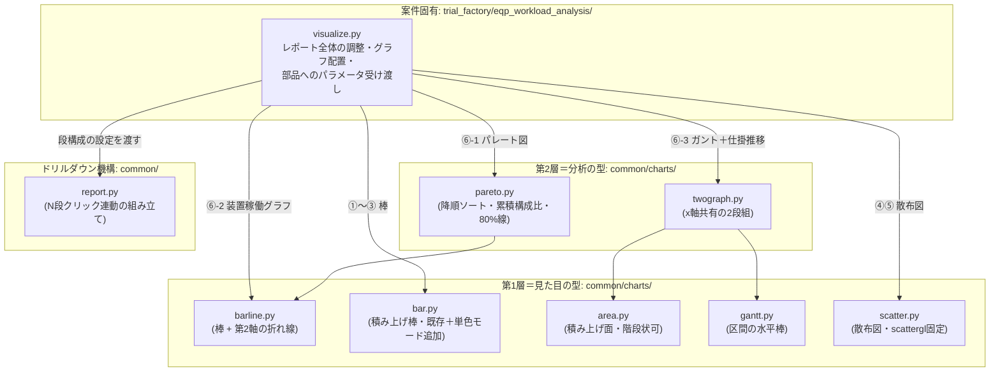
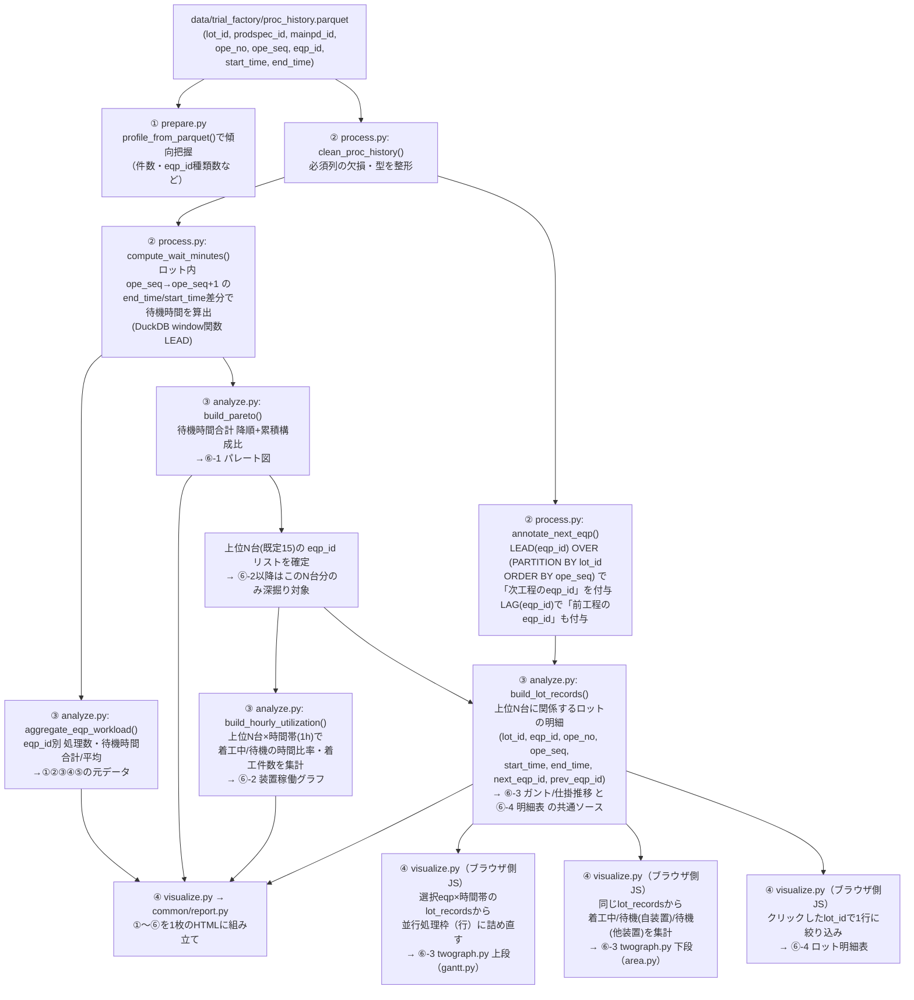

# design.md — 設備稼働負荷・ロット待機分析ツールの設計

`requirements.md`（承認済み）に基づく実装設計。画面配置・各グラフの見せ方の
確定版は、レビューで実際に操作して確認済みのモックをそのまま確定版として
扱う（変更が無いため再公開はしない）:
https://claude.ai/code/artifact/82556c36-ee84-4dba-aa07-ed6cb68b7208

## 1. 実装アプローチ

`docs/repository-structure.md`の通常フローに従い、`.steering/`を経由して
直接`src/`+`scripts/`へ実装する（`docs/reference/`は経由しない）。これが
本リポジトリ初の「本採用」のため、`docs/repository-structure.md`・
`docs/functional-design.md`の該当記述も実装後に更新する（詳細は
「7. 影響範囲」）。

- プロジェクト名: `trial_factory`
- ツール名: `eqp_workload_analysis`
- 4ステップ構成（`prepare`/`process`/`analyze`/`visualize`）+
  `cli.py`/`io.py`
- 可視化は`docs/architecture.md`の方針通りPlotly（`fig.write_html()`、
  `include_plotlyjs="cdn"`）。前回モックのSVGはあくまで画面確認用の仮描画で
  あり、実装はPlotlyの`go.Figure`ベースに置き換える。

## 2. 変更するコンポーネント

グラフ部品は3節の層構造に従って配置する。

| ファイル | 層 | 状態 | 役割 |
| --- | --- | --- | --- |
| `src/analyse_tool/common/charts/bar.py` | 第1層 | 既存＋微修正 | 積み上げ棒（`stacked_bar()`）。①②③で単色棒としても使うため`color`省略時の単色モードを追加 |
| `src/analyse_tool/common/charts/barline.py` | 第1層 | 新規 | 棒（1〜n系列・stack可）＋第2軸の折れ線。⑥-1と⑥-2で共用する |
| `src/analyse_tool/common/charts/area.py` | 第1層 | 新規 | 積み上げ面（階段状も可）。⑥-3の仕掛数量推移で使用 |
| `src/analyse_tool/common/charts/gantt.py` | 第1層 | 新規 | 区間の水平棒。並行処理枠を複数行として持てる |
| `src/analyse_tool/common/charts/scatter.py` | 第1層 | 新規 | 散布図（`scattergl`固定）。④⑤で使用 |
| `src/analyse_tool/common/charts/pareto.py` | 第2層 | 新規 | 降順ソート・累積構成比・80%目安線というパレート図の作法。描画は`barline.py`に委譲 |
| `src/analyse_tool/common/charts/twograph.py` | 第2層 | 新規 | x軸を共有し、ズーム・パン・ホバーが連動する2段組。⑥-3で`gantt.py`と`area.py`を組み合わせる |
| `src/analyse_tool/common/report.py` | 機構 | 拡張 | 1段階（棒→明細表）から、パレート図→装置稼働グラフ→ガント+仕掛推移→明細表の4段階に一般化。既存の1段版APIは維持し後方互換を壊さない |
| `src/analyse_tool/trial_factory/eqp_workload_analysis/{cli,io,prepare,process,analyze,visualize}.py` | 案件固有 | 新規 | 本ツール本体。`visualize.py`がレポート全体の調整・グラフ配置・部品へのパラメータ受け渡しを担う |
| `scripts/trial_factory/eqp_workload_analysis.py` | 新規 | エントリポイント |
| `docs/trial_factory/eqp_workload_analysis.md` | 新規 | 説明資料 |
| `docs/functional-design.md` | 更新（実装後） | コンポーネント表の状態更新、ドリルダウン方針を4段階に拡張したことを反映 |
| `docs/repository-structure.md` | 更新（実装後） | `trial_factory`を最初の本採用プロジェクトとして記載 |
| `docs/product-requirements.md` | 更新（実装後） | 「既知のリスク」の`docs/reference/`乖離リスクの扱いを見直す |

## 3. モジュール依存関係（グラフ関連）

レビューでの議論を経て、フラット構成ではなく**層構造**を採用する（採用理由
は本ファイル末尾の「レビュー議論の記録」を参照）。矢印は「利用する
（import する）」方向。

- **層をまたぐ一方向依存のみ許可し、同一層内の依存は禁止する。**
  第2層（`pareto.py`/`twograph.py`）は「分析の型」＝集計済みデータの並べ方
  ・強調の仕方を決め、実際の描画は第1層（`barline.py`/`bar.py`/`area.py`/
  `gantt.py`/`scatter.py`）に委譲する。第1層同士・第2層同士に依存関係は
  無い（それぞれ独立に`DataFrame`等を受け取り`go.Figure`を返す、または
  既存`fig`にtraceを追加する純関数群）。
  `docs/architecture.md`の「共通処理は各ツールのサブパッケージに依存しない
  一方向の関係を保つ」を踏襲し、`common/`配下からツール固有コード
  （`trial_factory/*`）への依存は作らない。
- **`common/report.py`はどのchartモジュールも import しない。**
  `visualize.py`が組み立てた`go.Figure`（各段1つ、`twograph.py`が返す
  subplot構成のFigureも「1段1Figure」として扱える）を受け取って埋め込む
  だけの機構に徹する。グラフの見た目を変えたいときはchartモジュール側
  だけを直せばよい。
- **`twograph.py`のx軸連動は、Plotlyの`make_subplots(shared_xaxes=True)`
  で実現する**（カスタムJSは書かない）。`twograph.py`が
  `make_subplots(rows=2, cols=1, shared_xaxes=True)`でFigureを作り、
  `gantt.py`/`area.py`に「既存Figureにtraceを追加する関数」
  （例: `add_gantt_traces(fig, row, col, ...)`）を呼んでもらう形にする。
  これによりブラウザ側でズーム・パン・ホバーが2段の間で自動的に連動する
  （Plotly標準機能。追加のJS実装が不要）。単体（1段だけ）で使いたい場合の
  薄いラッパーも用意する。

### `visualize.py`が案件ごとに肥大化しないための方針（レビューでの懸念事項）

複数プロジェクトが増えても各`visualize.py`が肥大化し続けないよう、次の
方針を`docs/development-guidelines.md`相当のローカルルールとして
`eqp_workload_analysis`実装時から適用する。

- `visualize.py`は**「どのグラフをどの段に、どんなパラメータで置くか」を
  決めるだけ**にし、実際の集計・描画ロジックは持たない（集計は
  `analyze.py`、描画は`common/charts/*`が担う）。
- セクション（①〜⑥）ごとに`_build_section1_count_chart()`のような小さい
  プライベート関数に分割し、1関数1セクションに留める。`main()`相当の
  `build_report()`はそれらを順番に呼ぶだけの一覧性の高い関数にする。
- **2つ以上のツールで同じ組み立てパターンが必要になって初めて**
  `common/`側への切り出しを検討する（`docs/repository-structure.md`の
  「`common/`配下に置くのは複数ツールで共有する処理のみ」を踏襲）。
  1ツールしか使わない段階で先回りして共通化しない。
- 本当に大きくなった場合は、`common/`に切り出すのではなく
  `trial_factory/eqp_workload_analysis/`パッケージ内で
  `visualize_sections.py`のように分割してもよい（あくまでツール内の分割。
  `common/`へは上記の「2ツール以上」の条件を満たしてから）。

## 4. データ加工処理の依存関係（`prepare`→`process`→`analyze`→`visualize`）

依頼のあった「データ加工処理の依存関係」をまとめる。矢印は「データが
流れる」方向。

ポイント:

- **①〜⑤・⑥-1（パレート図）までは`analyze.py`が集計済みの小さいDataFrame
  を作り、`visualize.py`にはそれだけを渡す**（既存方針通り）。
- **⑥-2（装置稼働グラフ）は上位N台分だけを`analyze.py`で事前集計**する
  （全400台分は作らない）。
- **⑥-3（ガント＋仕掛推移）と⑥-4（明細表）は、`analyze.py`が作る
  「上位N台に関係するロット明細（`LotDetail`）」という1つの共通データを
  ソースにする**。装置稼働グラフの1時間棒をクリックした時点で新たに
  Pythonを呼び直すことはできない（`file://`で開く自己完結HTMLのため）ので、
  クリック時の絞り込み・再集計（並行枠への詰め直し・3分類の件数集計）は
  ブラウザ側のJSで行う。ここは`common/report.py`が既に採用している
  「明細データをJSONで埋め込み、クリック時にJSで絞り込む」方式の延長線上
  にある。
- **`process.py`の`annotate_next_eqp()`**（`LEAD(eqp_id)`）が仕掛数量推移の
  3分類判定の起点になる。定義は次の通り（design確定事項）:
  - **待機中（自装置着工）**: 待機中のロットのうち、次工程の`eqp_id`が
    選択中の装置と一致するもの（＝これからこの装置に来る＝この装置の
    入り待ち行列）
  - **待機中（他装置着工）**: 待機中のロットのうち、直前工程の`eqp_id`が
    選択中の装置と一致し、かつ次工程の`eqp_id`が選択中の装置と異なるもの
    （＝この装置を出た直後で、別の装置に向けて待っている＝出口側の滞留）
  - この2分類だけでは「この装置に無関係な、工場内の他の待機ロット」は
    どちらにも属さず含まれない（意図的。この装置の稼働と直接関係する
    範囲に絞ることで、母数が工場全体のロット数に膨れ上がるのを防ぐ）。

## 5. データ量対策（`LotDetail`のサイズ管理）

`requirements.md`の受け入れ条件「全設備・全期間の初期表示で密集させない」
「大量データをそのまま埋め込まない」に対応する具体策:

- `LotDetail`は**パレート図で確定した上位N台（既定15台）のみ**を対象にする
  （全400台分は作らない）。
- 上位15台×平均処理数（既存サンプルで約10,500件/台）だと、そのままでは
  15万行規模になり埋め込みには重い。そのため`analyze.py`側でさらに
  **`time_range`のうち代表的な1区間（既定: 最初の3日間、`--gantt-days`等で
  可変にする）に絞った`LotDetail`のみ**をHTMLに埋め込む。装置稼働グラフの
  1時間棒（24時間分）は、この絞り込んだ区間内の時間帯のみクリック可能に
  し、その旨をUI上に注記する（「直近3日間のみドリルダウン可」等）。
- 上記の絞り込み日数・件数上限は実データ（`prepare.py`のプロファイル結果）
  を見て`tasklist.md`実装時に具体値を確定する。埋め込みJSONが大きくなり
  すぎる場合は、`common/report.py`の`max_detail_rows`と同様に上限件数を
  設け、超過時はその旨を注記する。

## 6. `common/report.py`の拡張方式

現状の`build_bar_click_detail_html()`（1段: 棒グラフ→明細表）は変更せず
残す（`customer_pref_summary`が利用中のため）。新たに、`docs/functional-design.md`
の「ドリルダウンの二段拡張」で構想されていたフィルタ条件リスト方式を
実装した関数を追加する。

- 新関数（案）: `build_multi_stage_drilldown_html()`
  - 引数: 各段のFigure（`figs: list[go.Figure]`）、最終段の明細
    DataFrame、段間の対応付け設定（各段のクリックで何が決まるか）。
  - ⑥-3（ガント＋仕掛推移）は`twograph.py`が1つの`go.Figure`（subplot
    構成）として返すため、**「1段＝1Figure」のままで済む**
    （3節の設計により、report.py側で複数Figureを1段にまとめる特別対応は
    不要になった）。
  - 段2→段3、段3→段4の絞り込みロジック（時間帯選択、ロット選択）は
    ツール固有の解釈が要るため、絞り込み用のJSスニペット自体は
    `visualize.py`側でパラメータ化して`report.py`に渡す
    （`report.py`は組み立てに徹し、ドメイン知識を持たない既存方針を踏襲）。
  - 詳細な関数シグネチャ・JSのAPI設計は`tasklist.md`着手時に確定する
    （既存`build_bar_click_detail_html()`のテンプレート機構を土台にする）。

## 7. 各グラフの見せ方（確定版）

Artifactモック（上記URL）の通りとし、以下はPlotly実装時のパラメータ確定
事項。

| グラフ | 部品（層） | 種類 | 軸 | 初期表示 | 備考 |
| --- | --- | --- | --- | --- | --- |
| ①設備ごとの処理数 | `bar.py`(第1層) | 単色棒 | x=eqp_id, y=処理数 | 処理数降順・上位15台 | `bar.py`に`color`省略時の単色モードを追加 |
| ②③待機時間合計/平均 | `bar.py`(第1層) | 単色棒 | x=eqp_id, y=分 | 上位10台 | 同上 |
| ④⑤散布図 | `scatter.py`(第1層) | scattergl | x=処理数, y=待機時間 | 全上位15台点表示 | 新規実装（`docs/functional-design.md`に追記） |
| ⑥-1パレート図 | `pareto.py`(第2層)→`barline.py`(第1層) | 棒＋線（2軸） | x=eqp_id（待機時間合計降順）, y1=待機時間合計, y2=累積構成比(0-100%) | 上位15台、累積80%ラインの目安線を表示 | クリックでeqp_id選択 |
| ⑥-2装置稼働グラフ | `barline.py`(第1層) | 積み上げ棒＋線（2軸） | x=時刻(1h), y1=着工中/待機の時間比率, y2=着工件数 | 選択eqpの24時間 | クリックで時間帯選択（5.のデータ量対策により選択可能な範囲を絞る場合あり） |
| ⑥-3ガント（twograph上段） | `twograph.py`(第2層)→`gantt.py`(第1層) | 水平棒（`base`+`x`で区間表現） | y=並行処理枠（行）, x=時刻 | 選択eqp・選択時間帯を中心とした窓（既定4時間） | 着工中区間に`lot_id`をテキスト表示、待機はグレー |
| ⑥-3仕掛数量推移（twograph下段） | `twograph.py`(第2層)→`area.py`(第1層) | 積み上げ面（階段状、`stackgroup`） | x=時刻（ガントと共有のx軸） | ガントと同じ窓 | 3分類（着工中／待機中(自)／待機中(他)）。`shared_xaxes=True`によりガントとズーム・パン連動 |
| ⑥-4ロット明細表 | `common/report.py` | HTML表 | - | 選択ロット1件（同一lot_id内の全工程行も参考として表示するかはtasklist時に決定） | `common/report.py`の明細表描画を流用 |

`common/charts/scatter.py`が未実装だった点は、要件定義時に見落としていた
ため、ここで`docs/functional-design.md`のコンポーネント表に合わせて
新規実装対象に加える（④⑤で使用）。

## 8. 影響範囲の分析（実装後に反映する永続的ドキュメント）

- `docs/functional-design.md`
  - 「見た目の型（第1層）／分析の型（第2層）」という層構造の原則、および
    `common/charts/`コンポーネント表・`common/report.py`のドリルダウン
    設計方針（各段は「1段＝1Figure」）は、**design承認時点で先行反映済み**
    （設計は実装より前から確定している一般原則のため）。実装後は各モジュール
    の状態を「未実装（設計合意済み）」→「実装済み」に更新するだけでよい
  - 「ツールごとの実装」表に`eqp_workload_analysis`を追加（実装後）
- `docs/development-guidelines.md`
  - `visualize.py`肥大化対策（1セクション1関数・2ツール以上で共通化する
    までは`common/`に先回りしない）は**design承認時点で先行反映済み**
- `docs/repository-structure.md`
  - 「現時点では具体的なプロジェクトが1つも本採用されていない」という
    記述を、`trial_factory`が最初の本採用プロジェクトであることが分かる
    ように更新
- `docs/product-requirements.md`
  - 「既知のリスク」の`docs/reference/`乖離リスクは、
    `customer_pref_summary`・`generate_sample_data`がまだ`docs/reference/`
    に残っている間は解消しない（今回の対象外）ため、リスク文言はそのまま
    残す旨を明記するに留める（削除しない）

## 9. 実装時に確定する残課題（tasklist.md着手前に軽く合意を取る）

- ⑥-3の窓幅（既定4時間、モック準拠）・ドリルダウン対象期間（既定3日間）の
  既定値は、実データ（`prepare.py`の結果）を見てから微調整してよいか
- ロット明細表は1ロット1行のみか、そのロットの全工程行を並べるか

## 10. レビュー議論の記録（グラフモジュール構成: フラット案 vs 層構造案）

design.md初版はグラフ部品をフラットに並べる構成（`pareto.py`/
`timeline.py`/`gantt.py`が`common/charts/`に横並び）だったが、レビューで
次の指摘を受け、層構造（本ファイルの3節）に変更した。

- **指摘**: パレート図と装置稼働グラフはどちらも「棒＋第2軸の折れ線」で
  同じ図形なのに、フラット案では別モジュールに実装が重複する。
  「見た目の型（第1層: bar/barline/gantt/area/scatter）」と「分析の型
  （第2層: pareto/twograph）」に分け、第2層が第1層に処理を委譲する構成に
  すべきではないか。
- **対応**: 3節の層構造を採用。`barline.py`（第1層）を新設し、
  `pareto.py`・装置稼働グラフの両方がこれを使うことで重複を解消した。
- **懸念1（本人確認済み・解決）**: 複数プロジェクトが増えるにつれ、
  案件固有の組み立てモジュール（`visualize.py`）が肥大化しないか。
  → 3節末尾の方針（1セクション1関数への分割、`common/`への切り出しは
  「2ツール以上で同じパターンが必要になってから」）で対応する。
- **懸念2（本人確認済み・解決）**: 仕掛数量推移は棒か面か。
  → 面（階段状）に決定。モックの見た目に合わせる。
- **懸念3（本人確認済み・解決）**: `twograph.py`の2グラフに、同じ横軸での
  ズーム・パン等の連動性を持たせたい（実装方式は一任）。
  → Plotlyの`make_subplots(shared_xaxes=True)`で実現する方針とした
  （3節参照。カスタムJSは不要）。
