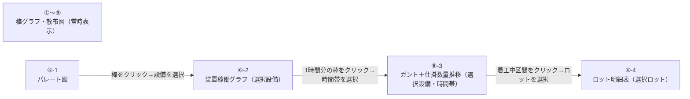
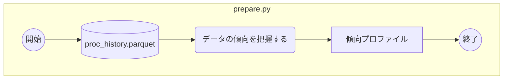
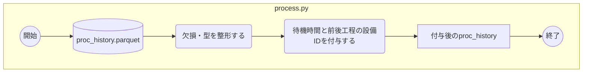
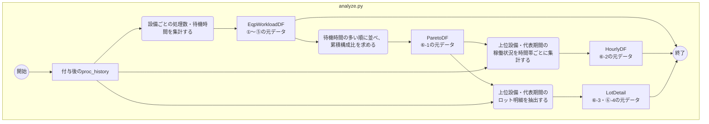
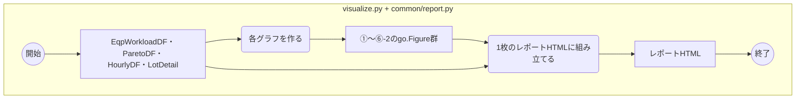
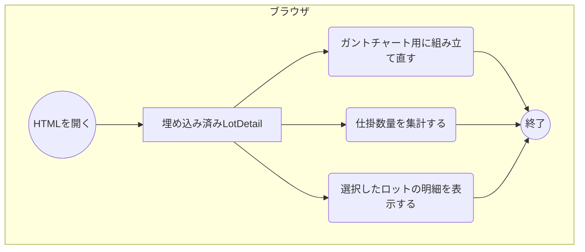
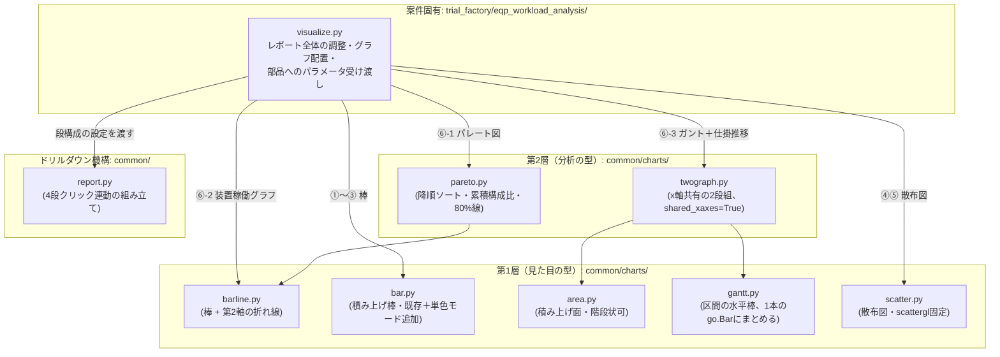

# design.md — 設備稼働負荷・ロット待機分析ツールの設計

`requirements.md`（承認済み）に基づく実装設計。`docs/templates/design.md`
の構成に従う。

## 対象

`trial_factory`プロジェクトの`eqp_workload_analysis`ツールを、本リポジトリ
初の「本採用」として`src/`+`scripts/`に新規実装する
（`docs/repository-structure.md`の通常フロー通り、`docs/reference/`は
経由しない）。4ステップ構成（`prepare`/`process`/`analyze`/`visualize`
+`cli.py`/`io.py`）、可視化はPlotly（`fig.write_html()`、
`include_plotlyjs="cdn"`）。

### 構成物一覧

| 種別 | 名称 | 対応種別 | 内容 |
| --- | --- | --- | --- |
| 画面 | 設備稼働負荷・ロット待機分析レポート | 新 | proc_historyを対象に①〜⑥の6セクションを1枚のHTMLにまとめる（画面レイアウト参照） |
| グラフ | ①〜⑤ 基本グラフ | 新 | 設備ごとの処理数・待機時間合計/平均の棒グラフ3種、処理数×待機時間の散布図2種 |
| グラフ | パレート図（⑥-1） | 新 | 設備別の待機時間合計を降順＋累積構成比で表示 |
| グラフ | 装置稼働グラフ（⑥-2） | 新 | 選択設備の1時間刻み稼働状況＋着工件数 |
| グラフ | ガントチャート（⑥-3上段） | 新 | 選択設備・時間帯のロット単位区間（並行処理枠に対応） |
| グラフ | 仕掛数量推移（⑥-3下段） | 新 | 着工中／待機中(自装置)／待機中(他装置)の3分類積み上げ面 |
| コード | `common/charts/{bar,barline,area,gantt,scatter}.py` | 新 | 第1層（見た目の型）。`bar.py`のみ既存に単色モードを追加 |
| コード | `common/charts/{pareto,twograph}.py` | 新 | 第2層（分析の型）。描画は第1層に委譲する |
| コード | `common/report.py` | 変 | 1段階（棒→明細表）から、4段階の逐次クリック型ドリルダウンに拡張。既存の1段版APIは維持 |
| コード | `trial_factory/eqp_workload_analysis/{cli,io,prepare,process,analyze,visualize}.py` | 新 | ツール本体 |
| コード | `scripts/trial_factory/eqp_workload_analysis.py` | 新 | エントリポイント（`customer_pref_summary`と同じ、`main()`を呼ぶだけの薄いラッパー） |
| データ | `EqpWorkloadDF`／`ParetoDF`／`HourlyDF`／`LotDetail` | 新 | `analyze.py`が作る集計データ（機能別処理フロー参照） |
| データ | `wait_minutes`／`next_eqp_id`／`prev_eqp_id` | 新 | `process.py`が`proc_history`に付与する列 |
| ドキュメント | `docs/trial_factory/eqp_workload_analysis.md` | 新 | 説明資料 |
| ドキュメント | `docs/functional-design.md` | 変 | 層構造の原則・コンポーネント表・ドリルダウン方針を反映（先行反映済み） |
| ドキュメント | `docs/development-guidelines.md` | 変 | `visualize.py`肥大化対策を反映（先行反映済み） |
| ドキュメント | `docs/repository-structure.md` | 変 | `trial_factory`を最初の本採用プロジェクトとして記載（実装後） |
| ドキュメント | `docs/product-requirements.md` | 変 | 「既知のリスク」の`docs/reference/`乖離リスクの扱いを見直す（実装後） |

## 画面レイアウト

確定版はレビューで実際に操作して確認済みのモックをそのまま用いる
（変更が無いため再公開はしない）:
https://claude.ai/code/artifact/82556c36-ee84-4dba-aa07-ed6cb68b7208

各グラフの種類・軸・初期表示・備考:

| グラフ | 部品（層） | 種類 | 軸 | 初期表示 | 備考 |
| --- | --- | --- | --- | --- | --- |
| ①設備ごとの処理数 | `bar.py`(第1層) | 単色棒 | x=eqp_id, y=処理数 | 処理数降順・上位15台 | |
| ②③待機時間合計/平均 | `bar.py`(第1層) | 単色棒 | x=eqp_id, y=分 | 上位10台 | |
| ④⑤散布図 | `scatter.py`(第1層) | scattergl | x=処理数, y=待機時間 | 上位15台点表示 | |
| ⑥-1パレート図 | `pareto.py`→`barline.py` | 棒＋線（2軸） | x=eqp_id（待機時間合計降順）, y1=待機時間合計, y2=累積構成比 | 上位15台、累積80%目安線 | クリックでeqp_id選択 |
| ⑥-2装置稼働グラフ | `barline.py`(第1層) | 積み上げ棒＋線（2軸） | x=時刻(1h), y1=着工中/待機比率, y2=着工件数 | 選択設備の代表期間分（既定3日間＝72本） | クリックで時間帯選択 |
| ⑥-3ガント | `twograph.py`→`gantt.py` | 水平棒（`base`+`x`） | y=並行処理枠（行）, x=時刻 | 選択時間帯を中心とした窓（既定4時間） | 着工中区間に`lot_id`表示、待機はグレー。並行数についての注記あり（課題対応参照） |
| ⑥-3仕掛数量推移 | `twograph.py`→`area.py` | 積み上げ面（階段状） | x=時刻（ガントと共有） | ガントと同じ窓 | 3分類。`shared_xaxes=True`でガントとズーム・パン連動 |
| ⑥-4ロット明細表 | `common/report.py` | HTML表 | - | 選択ロット1件 | |

## 画面遷移図

## 機能別処理フロー

表記方法は`docs/diagram-guidelines.md`の「アクティビティ図（処理順序図）の
描き方」に従う（モジュール間の呼び出し関係＝importの方向は次節
「コンポーネント構成図」を参照。混ぜない）。

### `prepare.py`（EDA、独立した枝）

- 「データの傾向を把握する」＝`profile_from_parquet()`（件数・eqp_id種類数
  などをSQLで集計）
- 「傾向プロファイル」＝`write_profile()`が`profiles/`配下に書き出す
  JSON。レポート組み立てには使わない（既存`customer_pref_summary`と
  同じ位置づけ）

### `process.py`（クレンジング）

- 「欠損・型を整形する」＝`clean_proc_history()`（必須列の欠損除去・
  型整形）
- 「待機時間と前後工程の設備IDを付与する」＝`annotate_lot_sequence()`。
  `lot_id`ごとに`ope_seq`順に並べ、**1回のSELECT文**（DuckDBのwindow
  関数、`PARTITION BY lot_id ORDER BY ope_seq`）で次の3列を付与する。
  待機時間の算出と前後工程の付与を別々の2パスにせず、数百万行の
  テーブルを2回スキャンしない。
  - `wait_minutes` = このope_seqの`start_time` − 1つ前のope_seqの
    `end_time`（`LAG(end_time)`）
  - `next_eqp_id` = 1つ後のope_seqの`eqp_id`（`LEAD(eqp_id)`）
  - `prev_eqp_id` = 1つ前のope_seqの`eqp_id`（`LAG(eqp_id)`）
- 「付与後のproc_history」＝上記3列を付与したもの（DuckDBリレーション、
  〜数百万行）。`analyze.py`へそのまま渡す

### `analyze.py`（集計）

「付与後のproc_history」は`process.py`の出力そのもの（前図の
`AnnotatedData2`）。

- 「設備ごとの処理数・待機時間を集計する」＝`aggregate_eqp_workload()`。
  `eqp_id`ごとに`COUNT(*)`・`SUM(wait_minutes)`・`AVG(wait_minutes)`を
  SQLで集計し、ここで初めて`.df()`する（約400行）
- 「待機時間の多い順に並べ、累積構成比を求める」＝`build_pareto()`
  （pandas。入力が約400行なので軽い）
- 「上位設備・代表期間の稼働状況を時間帯ごとに集計する」＝
  `build_hourly_utilization()`。ここでの上位設備・代表期間は、パレート図
  で並べた上位N台（既定15）・既定3日間を指す。`generate_series`と区間
  交差の判定で時間帯ごとにSQL集計する（Pythonでロットごとに按分しない）
- 「上位設備・代表期間のロット明細を抽出する」＝`build_lot_records()`。
  同じ上位N台・代表期間で`WHERE`絞り込みしたロット明細をSQLで抽出する

数百万行を扱うのは`process.py`まで。`analyze.py`に入った時点で
`EqpWorkloadDF`（約400行）・`HourlyDF`（数百行）・`LotDetail`（数千行）の
いずれかまで小さくなっており、それ以降だけがpandas・ブラウザJSに渡る。

### `visualize.py` + `common/report.py`

「EqpWorkloadDF・ParetoDF・HourlyDF・LotDetail」は`analyze.py`の出力
（前図の`WorkloadDF3`・`ParetoDF3`・`HourlyDF3`・`LotDetailData3`）。

- 「各グラフを作る」＝「コンポーネント構成図」節のchartモジュール
  （`bar.py`/`barline.py`等）を`visualize.py`が呼び、①〜⑥-2の
  `go.Figure`を作る
- 「1枚のレポートHTMLに組み立てる」＝`common/report.py`へFigure群と
  `LotDetail`を渡して自己完結HTMLに組み立てる（`LotDetail`はcolumnar
  JSONとして埋め込む）
- 「レポートHTML」が書き出されたところで`uv run python scripts/...`の
  Pythonプロセスは終了する

### ブラウザ（HTMLを開いた後・クリックのたびに動くJS）

「埋め込み済みLotDetail」は前図の「レポートHTML」に埋め込まれている
`LotDetail`そのもの。

- 「ガントチャート用に組み立て直す」＝⑥-3上段（`twograph.py`→
  `gantt.py`）を表示する
- 「仕掛数量を集計する」＝⑥-3下段（`twograph.py`→`area.py`）を表示する
- 「選択したロットの明細を表示する」＝⑥-4のロット明細表を表示する

いずれもPythonプロセス終了後にブラウザ側で動くJSであり、スクリプト
実行1回に対して0回〜何度でも起こりうる（`process.py`〜`visualize.py`の
一本道とは性質が違う）。

## コンポーネント構成図

グラフ部品は「第1層（見た目の型）」と「第2層（分析の型）」の層構造を採る。
矢印は「利用する（import する）」方向。

層をまたぐ一方向依存のみ許可し、同一層内の依存は禁止する。`common/report.py`
はどのchartモジュールもimportせず、`visualize.py`が組み立てた`go.Figure`
（各段1つ。`twograph.py`のsubplot構成も「1段1Figure」として扱える）を
受け取って埋め込むだけの機構に徹する。`common/`配下からツール固有コード
（`trial_factory/*`）への依存は作らない。

## 課題対応

| 課題 | 対応 |
| --- | --- |
| ガントチャートの並行処理枠は何行を想定するか | モックの3〜4行は実データ（`data/trial_factory/proc_history.parquet`をDuckDBのスイープライン集計で実測）に対して不足していた（設備あたり同時並行ピークは平均9・最大16）。行数は貪欲法（区間スケジューリング、O(n log n)）の詰め直し結果に応じて可変にし、縦スクロール前提にする。これは`generate_proc_history`が設備の同時使用制約（1台1ロット）を実装していない副作用であり、実際の工場のバッチ挙動ではないため、画面に「サンプルデータは設備の同時使用制約を持たないため並行数が多く出る」旨を注記する |
| `common/report.py`のドリルダウンのデータ契約 | 段によって鍵の候補数が大きく違う（eqp_idは15種類だが、eqp×時間帯は15×72=1080通り）。段1→段2（パレート図→装置稼働グラフ）は**選択式**（Pythonが上位15台分の`go.Figure`を全て事前レンダリングし、クリックは表示/非表示の切り替えのみ）、段2→段3・段3→段4は**構築式**（候補数が多すぎるため、絞り込み済み`LotDetail`から都度JSが図・表を組み立てる）に分ける。`report.py`自体はdiv配置と埋め込みJSONの書き出しのみを持ち、ドメイン固有のJSは`visualize.py`側から渡す |
| `twograph.py`（ガント＋仕掛推移）内でのクリック分離 | 1つのFigure内の2段に対する`plotly_click`はどちらの段のクリックでも発火する。ガントのtraceを1本の`go.Bar`にまとめたうえで、`twograph.py`がガントのtraceを`curveNumber === 0`に固定する順でtraceを追加することで、ガント側だけを確定的に判定できる。実機での動作確認は残課題とする |
| 仕掛数量推移の3分類の定義 | 待機中（自装置着工）＝次工程の`eqp_id`が選択中の設備と一致（これから来る）。待機中（他装置着工）＝直前工程の`eqp_id`が選択中の設備と一致し、かつ次工程が別の設備（出た直後）。この2分類に属さない工場内の他の待機ロットは対象に含めない（母数が膨れ上がるのを防ぐ意図的な絞り込み） |
| `visualize.py`が案件の増加に伴い肥大化しないか | 集計・描画ロジックは持たせず「どのグラフをどの段に置くか」の決定だけにする。セクションごとに小さいプライベート関数へ分割し、`common/`への切り出しは「2つ以上のツールで同じ組み立てパターンが必要になってから」に限る（`docs/development-guidelines.md`。1ツールの段階で先回りしない） |
| ロットの着工区間（ガントの四角）の描画・データ量 | 区間ごとに`add_trace()`せず、`x`/`base`/`y`/`marker_color`/`text`を配列にして1本の`go.Bar`にまとめる。ロットIDのラベルは区間の幅で出し分ける。埋め込みJSONは records 形式でなく columnar 形式にしてサイズを削減する |

## 残課題

- `bar.py`の単色モード追加のシグネチャ（`stacked_bar()`の引数をオプショナル
  化するか、別関数`simple_bar()`を足すか）
- `annotate_lot_sequence()`の境界ケース: ロットの最初の工程は
  `prev_eqp_id`が`NULL`、最後の工程は`next_eqp_id`が`NULL`になる。仕掛
  数量推移の3分類判定はこの`NULL`をどちらにも該当しないとして扱う
  （ユニットテストの項目に明記する）
- 仕掛数量推移の3分類が実データでどの程度意味のある分布になるかは
  `prepare.py`実装後に確認する
- ⑥-3の窓幅（既定4時間）・代表期間（既定3日間）は、実データを見て微調整
  してよい
- ロット明細表は1ロット1行のみか、そのロットの全工程行を並べるか
- `twograph.py`のクリック分離（`curveNumber`判定）は、実装の初期タスクと
  して小さいサンプルで動作確認する
