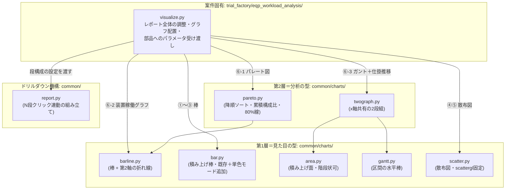
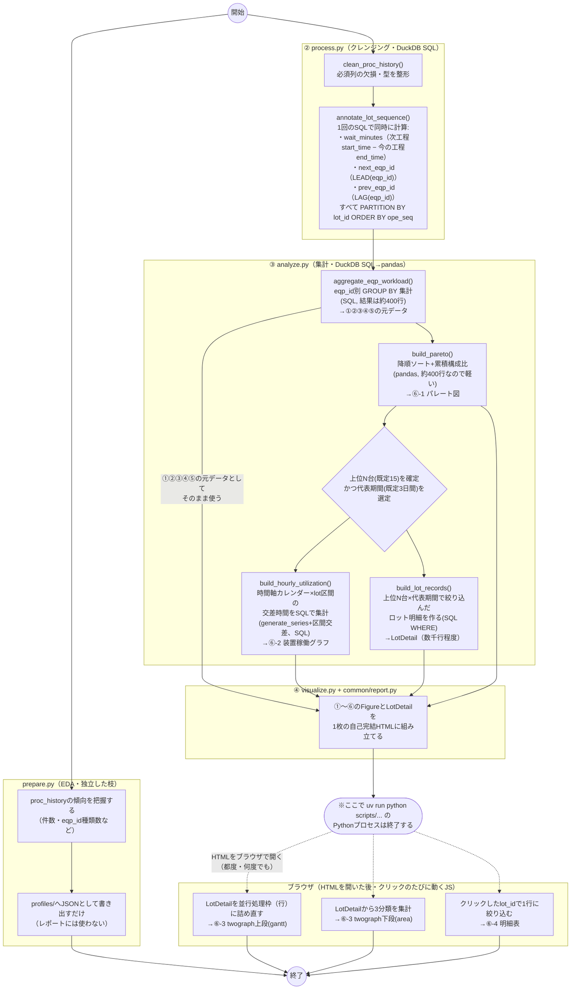

# design.md — 設備稼働負荷・ロット待機分析ツールの設計

`requirements.md`（承認済み）に基づく実装設計。画面配置・各グラフの見せ方の
確定版は、レビューで実際に操作して確認済みのモックをそのまま確定版として
扱う（変更が無いため再公開はしない）:
https://claude.ai/code/artifact/82556c36-ee84-4dba-aa07-ed6cb68b7208

## 1. 実装アプローチ

`docs/repository-structure.md`の通常フローに従い、`.steering/`を経由して
直接`src/`+`scripts/`へ実装する（`docs/reference/`は経由しない）。これが
本リポジトリ初の「本採用」のため、`docs/repository-structure.md`・
`docs/functional-design.md`の該当記述も実装後に更新する（詳細は
「7. 影響範囲」）。

- プロジェクト名: `trial_factory`
- ツール名: `eqp_workload_analysis`
- 4ステップ構成（`prepare`/`process`/`analyze`/`visualize`）+
  `cli.py`/`io.py`
- 可視化は`docs/architecture.md`の方針通りPlotly（`fig.write_html()`、
  `include_plotlyjs="cdn"`）。前回モックのSVGはあくまで画面確認用の仮描画で
  あり、実装はPlotlyの`go.Figure`ベースに置き換える。

## 2. 変更するコンポーネント

グラフ部品は3節の層構造に従って配置する。

| ファイル | 層 | 状態 | 役割 |
| --- | --- | --- | --- |
| `src/analyse_tool/common/charts/bar.py` | 第1層 | 既存＋微修正 | 積み上げ棒（`stacked_bar()`）。①②③で単色棒としても使うため`color`省略時の単色モードを追加 |
| `src/analyse_tool/common/charts/barline.py` | 第1層 | 新規 | 棒（1〜n系列・stack可）＋第2軸の折れ線。⑥-1と⑥-2で共用する |
| `src/analyse_tool/common/charts/area.py` | 第1層 | 新規 | 積み上げ面（階段状も可）。⑥-3の仕掛数量推移で使用 |
| `src/analyse_tool/common/charts/gantt.py` | 第1層 | 新規 | 区間の水平棒。並行処理枠を複数行として持てる（実データ確認により平均9・最大16行程度を想定、11節参照） |
| `src/analyse_tool/common/charts/scatter.py` | 第1層 | 新規 | 散布図（`scattergl`固定）。④⑤で使用 |
| `src/analyse_tool/common/charts/pareto.py` | 第2層 | 新規 | 降順ソート・累積構成比・80%目安線というパレート図の作法。描画は`barline.py`に委譲 |
| `src/analyse_tool/common/charts/twograph.py` | 第2層 | 新規 | x軸を共有し、ズーム・パン・ホバーが連動する2段組。⑥-3で`gantt.py`と`area.py`を組み合わせる |
| `src/analyse_tool/common/report.py` | 機構 | 拡張 | 1段階（棒→明細表）から、パレート図→装置稼働グラフ→ガント+仕掛推移→明細表の4段階に一般化。既存の1段版APIは維持し後方互換を壊さない |
| `src/analyse_tool/trial_factory/eqp_workload_analysis/{cli,io,prepare,process,analyze,visualize}.py` | 案件固有 | 新規 | 本ツール本体。`visualize.py`がレポート全体の調整・グラフ配置・部品へのパラメータ受け渡しを担う |
| `scripts/trial_factory/eqp_workload_analysis.py` | - | 新規 | エントリポイント（後述） |
| `docs/trial_factory/eqp_workload_analysis.md` | - | 新規 | 説明資料 |
| `docs/functional-design.md` | - | 更新（実装後） | コンポーネント表の状態更新、ドリルダウン方針を4段階に拡張したことを反映 |
| `docs/repository-structure.md` | - | 更新（実装後） | `trial_factory`を最初の本採用プロジェクトとして記載 |
| `docs/product-requirements.md` | - | 更新（実装後） | 「既知のリスク」の`docs/reference/`乖離リスクの扱いを見直す |

### `scripts/trial_factory/eqp_workload_analysis.py`について

`docs/repository-structure.md`の定義通り「CLI引数解析と`main()`呼び出しの
みの薄いラッパー」で、それ自体は何も処理しない。実処理は全て
`src/analyse_tool/trial_factory/eqp_workload_analysis/`側に置く
（`customer_pref_summary`と同じ位置づけ。参考:
`docs/reference/analyse_tool/customer_pref_summary/__init__.py`の
`main()`）。

```python
"""eqp_workload_analysis のエントリポイント（薄いラッパー）。"""

from __future__ import annotations

from analyse_tool.trial_factory.eqp_workload_analysis import main

if __name__ == "__main__":
    main()
```

利用者はこれを`uv run python scripts/trial_factory/eqp_workload_analysis.py
--input data/trial_factory/proc_history.parquet --output output/...`のように
実行する。`main()`側（`__init__.py`）が`cli.py`で引数を解析し、
`prepare`→`process`→`analyze`→`visualize`を順に呼ぶ。

## 3. モジュール依存関係（グラフ関連）

レビューでの議論を経て、フラット構成ではなく**層構造**を採用する（採用理由
は本ファイル末尾の「レビュー議論の記録」を参照）。矢印は「利用する
（import する）」方向。



- **層をまたぐ一方向依存のみ許可し、同一層内の依存は禁止する。**
  第2層（`pareto.py`/`twograph.py`）は「分析の型」＝集計済みデータの並べ方
  ・強調の仕方を決め、実際の描画は第1層（`barline.py`/`bar.py`/`area.py`/
  `gantt.py`/`scatter.py`）に委譲する。第1層同士・第2層同士に依存関係は
  無い（それぞれ独立に`DataFrame`等を受け取り`go.Figure`を返す、または
  既存`fig`にtraceを追加する純関数群）。
  `docs/architecture.md`の「共通処理は各ツールのサブパッケージに依存しない
  一方向の関係を保つ」を踏襲し、`common/`配下からツール固有コード
  （`trial_factory/*`）への依存は作らない。
- **`common/report.py`はどのchartモジュールも import しない。**
  `visualize.py`が組み立てた`go.Figure`（各段1つ、`twograph.py`が返す
  subplot構成のFigureも「1段1Figure」として扱える）を受け取って埋め込む
  だけの機構に徹する。グラフの見た目を変えたいときはchartモジュール側
  だけを直せばよい。
- **`twograph.py`のx軸連動は、Plotlyの`make_subplots(shared_xaxes=True)`
  で実現する**（カスタムJSは書かない）。`twograph.py`が
  `make_subplots(rows=2, cols=1, shared_xaxes=True)`でFigureを作り、
  `gantt.py`/`area.py`に「既存Figureにtraceを追加する関数」
  （例: `add_gantt_traces(fig, row, col, ...)`）を呼んでもらう形にする。
  これによりブラウザ側でズーム・パン・ホバーが2段の間で自動的に連動する
  （Plotly標準機能。追加のJS実装が不要）。単体（1段だけ）で使いたい場合の
  薄いラッパーも用意する。

### `visualize.py`が案件ごとに肥大化しないための方針（レビューでの懸念事項）

複数プロジェクトが増えても各`visualize.py`が肥大化し続けないよう、次の
方針を`docs/development-guidelines.md`相当のローカルルールとして
`eqp_workload_analysis`実装時から適用する。

- `visualize.py`は**「どのグラフをどの段に、どんなパラメータで置くか」を
  決めるだけ**にし、実際の集計・描画ロジックは持たない（集計は
  `analyze.py`、描画は`common/charts/*`が担う）。
- セクション（①〜⑥）ごとに`_build_section1_count_chart()`のような小さい
  プライベート関数に分割し、1関数1セクションに留める。`main()`相当の
  `build_report()`はそれらを順番に呼ぶだけの一覧性の高い関数にする。
- **2つ以上のツールで同じ組み立てパターンが必要になって初めて**
  `common/`側への切り出しを検討する（`docs/repository-structure.md`の
  「`common/`配下に置くのは複数ツールで共有する処理のみ」を踏襲）。
  1ツールしか使わない段階で先回りして共通化しない。
- 本当に大きくなった場合は、`common/`に切り出すのではなく
  `trial_factory/eqp_workload_analysis/`パッケージ内で
  `visualize_sections.py`のように分割してもよい（あくまでツール内の分割。
  `common/`へは上記の「2ツール以上」の条件を満たしてから）。

## 4. データ加工の処理順序（アクティビティ図）

**前回の図は「データがどこからどこへ流れるか」と「呼び出し関係」が
混ざっていて分かりにくかった。ここでは対象を「処理順序」1つに絞り、
UML アクティビティ図の語彙（開始・終了ノード／アクション／分岐／
フォーク・ジョイン／スイムレーン）に沿って書き直す。**

Mermaidに専用の「アクティビティ図」記法は無いため、`flowchart`を使い
`subgraph`をスイムレーン（担当モジュール）として使う、という一般的な
代用方法を採る。矢印は**すべて「この後どの処理を行うか」という順序**を表し
（呼び出し関係ではない。呼び出し関係＝importの方向は3節を参照）、
1つのノードから複数の矢印が出ている箇所はフォーク（並行実行可）、
複数の矢印が1つのノードに集まる箇所はジョイン（並行処理の合流）を表す。



**`prepare.py`は独立した枝であり、レポート組み立て（`Assemble`）には合流しない**
（既存`customer_pref_summary`と同じ位置づけ。`profile_from_parquet()`の結果は
`write_profile()`で`profiles/`配下にJSONとして書き出すだけで、`visualize.py`
には渡さない）。

**本当に一本道（数珠つなぎ）でつながっているのは`Clean`→`Annotate`→
`AggBar`→`Pareto`→`Decide`→（`Hourly`と`LotDetail`の並行実行）→
`Assemble`まで**で、ここで`uv run python scripts/...`のPythonプロセスは
終了する。それより先（ガント／仕掛推移／明細表の切り替え）は、レポート
HTMLをブラウザで開いたあとにクリックされるたびに動くJSであり、スクリプト
実行1回に対して0回〜何度でも起こりうる、性質の異なる「その後」である
（同じ矢印で数珠つなぎに繋ぐと誤解を招くため、点線＋区切りノードで明示的に
分けた）。

### SQL / pandas の境界（懸念点への回答）

「Pandasで重い処理になっていないか」への回答として、各アクティビティが
どちらで実行されるか、その時点のおおよその行数を明記する。

| アクティビティ | 実行エンジン | この時点の行数の目安 | 補足 |
| --- | --- | --- | --- |
| `clean_proc_history()` | DuckDB SQL | 〜数百万行 | `WHERE`と型整形のみ。DuckDBのリレーション（遅延評価）のまま次に渡す |
| `annotate_lot_sequence()` | DuckDB SQL | 〜数百万行 | `LEAD`/`LAG`をまとめて1回のSELECTに書く（**待機時間算出と次工程/前工程の付与を別々の2パスにしない**。同じ`PARTITION BY lot_id ORDER BY ope_seq`なので1回のwindow関数呼び出しで済む） |
| `aggregate_eqp_workload()` | DuckDB SQL → ここで初めて`.df()` | 数百万行 → **約400行** | `GROUP BY eqp_id`。結果が400行程度まで小さくなった時点で初めてpandasに渡す（`docs/architecture.md`の方針通り） |
| `build_pareto()` | pandas | 約400行 | 入力が既に小さいので、ソート＋累積和はpandasで十分軽い |
| `build_hourly_utilization()` | DuckDB SQL | 上位15台分に絞った後の数十万行 → 数百行 | **時間バケットへの分割は`generate_series`で作った1時間刻みのカレンダーと処理区間をJOINし、`least(end_time, bucket_end) - greatest(start_time, bucket_start)`のような区間交差の計算をSQLで行う（Pythonでロットごとに時間帯をループして手計算しない）**。集計結果は「上位15台×代表期間の時間数」程度の小さいテーブルになる |
| `build_lot_records()` | DuckDB SQL | 数百万行 → 上位15台×代表3日間で数千行程度 | `WHERE eqp_id IN (...) AND start_time BETWEEN ...`で先に絞り込んでから`.df()`する。全400台×全期間をpandasに載せることはしない |
| ブラウザ側のJS（詰め直し・集計・絞り込み） | JS（クライアント） | 数千行程度（`LotDetail`のみ） | `file://`で開く自己完結HTMLのため、クリック時にPythonは呼べない。対象は「上位15台×代表期間」に絞り込み済みの`LotDetail`のみなので、ブラウザでの処理も軽い（詳細は5節） |

ポイント（まとめ）:

- **数百万行を扱うのは`process.py`まで。`analyze.py`に入った時点で
  「①GROUP BY結果（400行）」「②時間バケット結果（数百行）」
  「③絞り込み済みLotDetail（数千行）」のいずれかまで小さくなっており、
  それ以降だけがpandas・ブラウザJSに渡る。**
- **待機時間の算出と次工程/前工程の付与は同じSQL文にまとめる**
  （`process.py`の関数は分けてもよいが、実行するSELECT文自体は1つにし、
  数百万行のテーブルを2回スキャンしない）。
- **時間帯ごとの集計（⑥-2）は必ずSQLの集合演算で行い、Pythonでロット単位
  にループして時間帯へ按分する実装は禁止**する（実質的に行数分のループに
  なり、数百万行規模では遅い）。
- 仕掛数量推移の3分類判定（`next_eqp_id`/`prev_eqp_id`）の定義:
  - **待機中（自装置着工）**: 待機中のロットのうち、次工程の`eqp_id`が
    選択中の装置と一致するもの（＝これからこの装置に来る＝この装置の
    入り待ち行列）
  - **待機中（他装置着工）**: 待機中のロットのうち、直前工程の`eqp_id`が
    選択中の装置と一致し、かつ次工程の`eqp_id`が選択中の装置と異なるもの
    （＝この装置を出た直後で、別の装置に向けて待っている＝出口側の滞留）
  - この2分類だけでは「この装置に無関係な、工場内の他の待機ロット」は
    どちらにも属さず含まれない（意図的。この装置の稼働と直接関係する
    範囲に絞ることで、母数が工場全体のロット数に膨れ上がるのを防ぐ）。

## 5. データ量対策（`LotDetail`のサイズ管理とガント描画の軽量化）

`requirements.md`の受け入れ条件「全設備・全期間の初期表示で密集させない」
「大量データをそのまま埋め込まない」に対応する具体策。`LotDetail`自体の
絞り込みに加えて、**ガントチャートで「ロットの着工を1つの四角として描く」
ときの具体的な軽量化策**（レビューでの質問への回答）を以下に分けて記す。

### 5-1. `LotDetail`（埋め込みデータ）のサイズ管理

- `LotDetail`は**パレート図で確定した上位N台（既定15台）のみ**を対象にする
  （全400台分は作らない）。
- 上位15台×平均処理数（既存サンプルで約10,500件/台）だと、そのままでは
  15万行規模になり埋め込みには重い。そのため`analyze.py`側でさらに
  **`time_range`のうち代表的な1区間（既定: 最初の3日間、`--gantt-days`等で
  可変にする）に絞った`LotDetail`のみ**をHTMLに埋め込む。装置稼働グラフの
  時間軸（既定: 代表期間分の1時間棒＝3日間なら72本）は、この絞り込んだ
  区間内の時間帯のみクリック可能にし、その旨をUI上に注記する
  （「直近3日間のみドリルダウン可」等）。
- 上記の絞り込み日数・件数上限は実データ（`prepare.py`のプロファイル結果）
  を見て`tasklist.md`実装時に具体値を確定する。埋め込みJSONが大きくなり
  すぎる場合は、`common/report.py`の`max_detail_rows`と同様に上限件数を
  設け、超過時はその旨を注記する。
- **埋め込みJSON自体は「行の配列（records）」ではなく列ごとの配列
  （columnar形式、例: `{"lot_id": [...], "eqp_id": [...], "start_time": [...]}`）
  にする**。キー名を行ごとに繰り返さないため、同じデータ量でもJSON
  サイズを大きく削減できる（`common/report.py`の1段版が使うrecords形式
  とは別の、ガント/仕掛推移専用のより軽い埋め込み形式にする）。

### 5-2. ガントチャート（⑥-3上段）の描画を軽くする具体策

- **1本のロット区間＝1つの`go.Bar`要素だが、トレース自体はまとめて1本に
  する。** 選択eqp・選択時間帯の区間をすべて集めて、`x`（区間の長さ）・
  `base`（開始位置）・`y`（並行処理枠の行）・`marker_color`（ステータス
  別の色）・`text`（ロットID）をそれぞれ配列として1つの`go.Bar`トレースに
  渡す（`fig.add_trace()`をロットの数だけ繰り返さない）。トレース数を
  1本に抑えることが、ブラウザの描画負荷を下げる一番効果的な対策になる。
- **ロットIDのラベル表示は区間の幅で出し分ける。** `text`配列を作る時点で
  Python側が区間の想定表示幅を計算し、狭すぎる区間は空文字列にする
  （ホバー時の`hovertext`には常にロットIDを入れておくので、情報は失わない）。
- **並行処理枠（行）への詰め直しは、ブラウザ側でも軽いアルゴリズムにする。**
  区間を開始時刻順に並べ、「その時点で空いている最初の行に置く。無ければ
  新しい行を作る」という貪欲法（区間スケジューリングの標準的な手法、
  計算量O(n log n)）で実装する。対象は5-1で絞り込み済みの
  `LotDetail`（選択eqp・時間帯の範囲内、実際には数十〜数百件程度）に
  限定されるため、ブラウザ側で毎回計算しても軽い。
  **実データで確認したところ、この行数（同時並行数）は平均9・最大16
  （11節参照）になるため、固定4行のような小さい前提を置かず、貪欲法の
  結果に応じて可変にし、縦方向はスクロール前提のレイアウトにする。**
- **想定を超えて区間数が多い時間帯への安全弁を設ける。** 万一1つの時間帯
  に極端に区間が多い場合に備え、`common/report.py`の`max_detail_rows`と
  同様に表示件数の上限を設け、超過時は「先頭N件のみ表示」と注記する。

## 6. `common/report.py`の拡張方式

現状の`build_bar_click_detail_html()`（1段: 棒グラフ→明細表）は変更せず
残す（`customer_pref_summary`が利用中のため）。新たに、`docs/functional-design.md`
の「ドリルダウンの二段拡張」で構想されていたフィルタ条件リスト方式を
実装した関数を追加する。

- 新関数（案）: `build_multi_stage_drilldown_html()`
  - 引数: 各段のFigure（`figs: list[go.Figure]`）、最終段の明細
    DataFrame、段間の対応付け設定（各段のクリックで何が決まるか）。
  - ⑥-3（ガント＋仕掛推移）は`twograph.py`が1つの`go.Figure`（subplot
    構成）として返すため、**「1段＝1Figure」のままで済む**
    （3節の設計により、report.py側で複数Figureを1段にまとめる特別対応は
    不要になった）。
  - 段2→段3、段3→段4の絞り込みロジック（時間帯選択、ロット選択）は
    ツール固有の解釈が要るため、絞り込み用のJSスニペット自体は
    `visualize.py`側でパラメータ化して`report.py`に渡す
    （`report.py`は組み立てに徹し、ドメイン知識を持たない既存方針を踏襲）。
  - 詳細な関数シグネチャ・JSのAPI設計は`tasklist.md`着手時に確定する
    （既存`build_bar_click_detail_html()`のテンプレート機構を土台にする）。

## 7. 各グラフの見せ方（確定版）

Artifactモック（上記URL）の通りとし、以下はPlotly実装時のパラメータ確定
事項。

| グラフ | 部品（層） | 種類 | 軸 | 初期表示 | 備考 |
| --- | --- | --- | --- | --- | --- |
| ①設備ごとの処理数 | `bar.py`(第1層) | 単色棒 | x=eqp_id, y=処理数 | 処理数降順・上位15台 | `bar.py`に`color`省略時の単色モードを追加 |
| ②③待機時間合計/平均 | `bar.py`(第1層) | 単色棒 | x=eqp_id, y=分 | 上位10台 | 同上 |
| ④⑤散布図 | `scatter.py`(第1層) | scattergl | x=処理数, y=待機時間 | 全上位15台点表示 | 新規実装（`docs/functional-design.md`に追記） |
| ⑥-1パレート図 | `pareto.py`(第2層)→`barline.py`(第1層) | 棒＋線（2軸） | x=eqp_id（待機時間合計降順）, y1=待機時間合計, y2=累積構成比(0-100%) | 上位15台、累積80%ラインの目安線を表示 | クリックでeqp_id選択 |
| ⑥-2装置稼働グラフ | `barline.py`(第1層) | 積み上げ棒＋線（2軸） | x=時刻(1h), y1=着工中/待機の時間比率, y2=着工件数 | 選択eqpの代表期間分（既定3日間＝72本） | クリックで時間帯選択（5節のデータ量対策により、選択可能な範囲は代表期間内に限る） |
| ⑥-3ガント（twograph上段） | `twograph.py`(第2層)→`gantt.py`(第1層) | 水平棒（`base`+`x`で区間表現） | y=並行処理枠（行）, x=時刻 | 選択eqp・選択時間帯を中心とした窓（既定4時間）。行数は貪欲法での詰め直し結果に従う（実測で平均9・最大16行、縦スクロール前提） | 着工中区間に`lot_id`をテキスト表示、待機はグレー。画面上に「サンプルデータは設備の同時使用制約を持たないため並行数が多く出る」旨の注記を表示（11節参照） |
| ⑥-3仕掛数量推移（twograph下段） | `twograph.py`(第2層)→`area.py`(第1層) | 積み上げ面（階段状、`stackgroup`） | x=時刻（ガントと共有のx軸） | ガントと同じ窓 | 3分類（着工中／待機中(自)／待機中(他)）。`shared_xaxes=True`によりガントとズーム・パン連動 |
| ⑥-4ロット明細表 | `common/report.py` | HTML表 | - | 選択ロット1件（同一lot_id内の全工程行も参考として表示するかはtasklist時に決定） | `common/report.py`の明細表描画を流用 |

`common/charts/scatter.py`が未実装だった点は、要件定義時に見落としていた
ため、ここで`docs/functional-design.md`のコンポーネント表に合わせて
新規実装対象に加える（④⑤で使用）。

## 8. 影響範囲の分析（実装後に反映する永続的ドキュメント）

- `docs/functional-design.md`
  - 「見た目の型（第1層）／分析の型（第2層）」という層構造の原則、および
    `common/charts/`コンポーネント表・`common/report.py`のドリルダウン
    設計方針（各段は「1段＝1Figure」）は、**design承認時点で先行反映済み**
    （設計は実装より前から確定している一般原則のため）。実装後は各モジュール
    の状態を「未実装（設計合意済み）」→「実装済み」に更新するだけでよい
  - 「ツールごとの実装」表に`eqp_workload_analysis`を追加（実装後）
- `docs/development-guidelines.md`
  - `visualize.py`肥大化対策（1セクション1関数・2ツール以上で共通化する
    までは`common/`に先回りしない）は**design承認時点で先行反映済み**
- `docs/repository-structure.md`
  - 「現時点では具体的なプロジェクトが1つも本採用されていない」という
    記述を、`trial_factory`が最初の本採用プロジェクトであることが分かる
    ように更新
- `docs/product-requirements.md`
  - 「既知のリスク」の`docs/reference/`乖離リスクは、
    `customer_pref_summary`・`generate_sample_data`がまだ`docs/reference/`
    に残っている間は解消しない（今回の対象外）ため、リスク文言はそのまま
    残す旨を明記するに留める（削除しない）

## 9. 実装時に確定する残課題（tasklist.md着手前に軽く合意を取る）

- ⑥-3の窓幅（既定4時間、モック準拠）・ドリルダウン対象期間（既定3日間）の
  既定値は、実データ（`prepare.py`の結果）を見てから微調整してよいか
- ロット明細表は1ロット1行のみか、そのロットの全工程行を並べるか

## 10. レビュー議論の記録（グラフモジュール構成: フラット案 vs 層構造案）

design.md初版はグラフ部品をフラットに並べる構成（`pareto.py`/
`timeline.py`/`gantt.py`が`common/charts/`に横並び）だったが、レビューで
次の指摘を受け、層構造（本ファイルの3節）に変更した。

- **指摘**: パレート図と装置稼働グラフはどちらも「棒＋第2軸の折れ線」で
  同じ図形なのに、フラット案では別モジュールに実装が重複する。
  「見た目の型（第1層: bar/barline/gantt/area/scatter）」と「分析の型
  （第2層: pareto/twograph）」に分け、第2層が第1層に処理を委譲する構成に
  すべきではないか。
- **対応**: 3節の層構造を採用。`barline.py`（第1層）を新設し、
  `pareto.py`・装置稼働グラフの両方がこれを使うことで重複を解消した。
- **懸念1（本人確認済み・解決）**: 複数プロジェクトが増えるにつれ、
  案件固有の組み立てモジュール（`visualize.py`）が肥大化しないか。
  → 3節末尾の方針（1セクション1関数への分割、`common/`への切り出しは
  「2ツール以上で同じパターンが必要になってから」）で対応する。
- **懸念2（本人確認済み・解決）**: 仕掛数量推移は棒か面か。
  → 面（階段状）に決定。モックの見た目に合わせる。
- **懸念3（本人確認済み・解決）**: `twograph.py`の2グラフに、同じ横軸での
  ズーム・パン等の連動性を持たせたい（実装方式は一任）。
  → Plotlyの`make_subplots(shared_xaxes=True)`で実現する方針とした
  （3節参照。カスタムJSは不要）。

## 11. 実データ確認で分かったこと（要対応）

4節のレビューをきっかけに、`data/trial_factory/proc_history.parquet`
（4,211,253行・設備400台）へ実際にDuckDBでスイープライン集計をかけて
確認した。

| 指標 | 実測値 |
| --- | --- |
| 同一設備で時間が重なる隣接ペアの割合 | 約77%（3,249,488 / 4,210,853） |
| 設備ごとの同時並行ピーク数（平均） | 約9本 |
| 設備ごとの同時並行ピーク数（最大） | 16本（`EQP305`等） |
| 同（最小） | 4本 |

**分かったこと**: これは工場のバッチ設備を模した挙動ではなく、
`generate_proc_history`が「同じ設備は同時に1ロットしか処理できない」
という排他制御をそもそも実装していない副作用（`generate_proc_history.md`
の検証ルールにも、他ロットとの時間重複を禁止する項目は無い）。つまり
ロットごとに独立に時刻を決めているため、統計的に大量の重複が発生する。

**対応**:

- モックで想定していた「並行処理枠3〜4行」は不足するため、5-2節・7節を
  実測値（平均9・最大16行）に合わせて修正済み（本コミットに反映済み）。
- ガントチャートの画面に、「このサンプルデータは設備の同時使用制約を
  モデル化していないため、実際の工場より並行数が多く出ます」という趣旨の
  注記を表示する（7節に追記済み）。
- 根本的にデータ生成側を直す（`generate_proc_history`に排他制御を
  実装する）選択肢もあるが、**今回のスコープには含めない**
  （`requirements.md`の制約事項「実データではなくサンプルデータを対象と
  する」の範囲内とし、注記で対応する）。将来`generate_proc_history`を
  改修する際の既知の課題としてどこかに記録しておく価値はある
  （`docs/reference/generate_proc_history.md`の「既知の制約・注意点」に
  追記する、等。今回のタスクの対象外なので実施はしない）。

## 12. design.mdの現状評価と残課題（正直な自己評価）

「design文書として十分か」という質問への回答。**まだ実装に入るには
詰め切れていない点がある**と考えている。特に上2つは`tasklist.md`着手前
に解消しておきたい。

- **①（要対応・上記11節で対応済み）** 並行処理枠の想定行数が実データと
  合っていなかった。→ 本コミットで修正済み。
- **②`common/report.py`の`build_multi_stage_drilldown_html()`の
  データ契約が抽象的すぎる。** 「各段のFigureとJSスニペットを受け取る」
  としか書いておらず、具体的に
  - 各段のFigureをどのdiv idで埋め込むか
  - 段2→段3、段3→段4の「クリック→次段の絞り込み条件」をどんなデータ
    構造で`visualize.py`から`report.py`に渡すか
  - `LotDetail`のcolumnar JSON（5-1節）とガント/仕掛推移のJS実装が
    具体的にどう結びつくか
  が未確定。ここが曖昧なまま`tasklist.md`に進むと、実装中に手戻りが
  起きるリスクが高い。**次のレビューまでに、この部分だけもう一段具体化
  したい。**
- **③`twograph.py`でのクリックイベント取得は未検証の想定。**
  `make_subplots(shared_xaxes=True)`でズーム・パン連動はPlotlyの標準
  機能だが、「ガント側の区間クリックで`plotly_click`イベントを拾い、
  仕掛推移側ではなくガント側のtraceだけを対象にする」という細かい制御が
  素直にできるかは、実装時に早めに小さい検証コードで確認すべき
  （設計判断自体を変える可能性は低いが、未検証であることは明記しておく）。
- **④`bar.py`の単色モード追加のシグネチャが未確定。** 「`color`省略時に
  単色棒にする」とだけ決めており、既存の`stacked_bar()`の引数をどう
  変えるか（オプショナル化するか、別関数`simple_bar()`を足すか）は
  `tasklist.md`時点で決める。
- **⑤`annotate_lot_sequence()`の境界ケースのテスト観点を明記していない。**
  ロットの最初の工程は`prev_eqp_id`が`NULL`、最後の工程は`next_eqp_id`が
  `NULL`になる。仕掛数量推移の3分類判定（4節）はこの`NULL`を「どちらの
  分類にも該当しない」として扱う必要があり、`tasklist.md`のユニット
  テスト項目に明記する。
- **⑥仕掛数量推移の3分類が実データでどの程度意味のある分布になるかは
  未確認。** 11節の発見（設備の同時使用制約が無い）を踏まえると、
  「待機中（自装置着工）」の母数も想定より多くなる可能性がある。
  `prepare.py`実装後、実際の分布を見て極端に偏っていないか確認する。

上記②③は設計の骨格に関わるため、**このまま`tasklist.md`に進んでよいか、
②③をもう一段詰めてから進むか、判断を仰ぎたい。**
