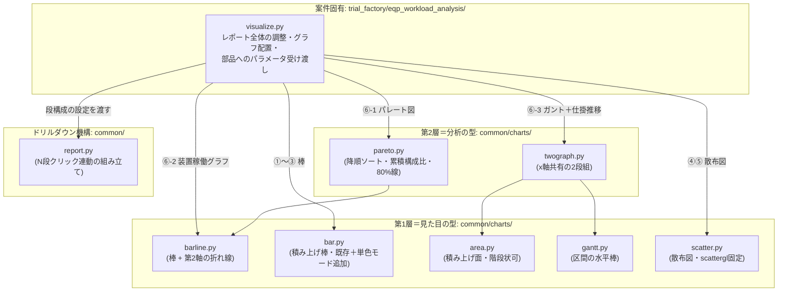
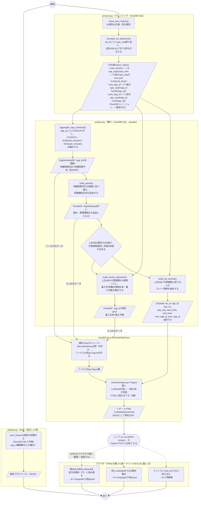

# design.md — 設備稼働負荷・ロット待機分析ツールの設計

`requirements.md`（承認済み）に基づく実装設計。画面配置・各グラフの見せ方の
確定版は、レビューで実際に操作して確認済みのモックをそのまま確定版として
扱う（変更が無いため再公開はしない）:
https://claude.ai/code/artifact/82556c36-ee84-4dba-aa07-ed6cb68b7208

## 1. 実装アプローチ

`docs/repository-structure.md`の通常フローに従い、`.steering/`を経由して
直接`src/`+`scripts/`へ実装する（`docs/reference/`は経由しない）。これが
本リポジトリ初の「本採用」のため、`docs/repository-structure.md`・
`docs/functional-design.md`の該当記述も実装後に更新する（詳細は
「8. 影響範囲の分析」）。

- プロジェクト名: `trial_factory`
- ツール名: `eqp_workload_analysis`
- 4ステップ構成（`prepare`/`process`/`analyze`/`visualize`）+
  `cli.py`/`io.py`
- 可視化は`docs/architecture.md`の方針通りPlotly（`fig.write_html()`、
  `include_plotlyjs="cdn"`）。前回モックのSVGはあくまで画面確認用の仮描画で
  あり、実装はPlotlyの`go.Figure`ベースに置き換える。

## 2. 変更するコンポーネント

グラフ部品は3節の層構造に従って配置する。

| ファイル | 層 | 状態 | 役割 |
| --- | --- | --- | --- |
| `src/analyse_tool/common/charts/bar.py` | 第1層 | 既存＋微修正 | 積み上げ棒（`stacked_bar()`）。①②③で単色棒としても使うため`color`省略時の単色モードを追加 |
| `src/analyse_tool/common/charts/barline.py` | 第1層 | 新規 | 棒（1〜n系列・stack可）＋第2軸の折れ線。⑥-1と⑥-2で共用する |
| `src/analyse_tool/common/charts/area.py` | 第1層 | 新規 | 積み上げ面（階段状も可）。⑥-3の仕掛数量推移で使用 |
| `src/analyse_tool/common/charts/gantt.py` | 第1層 | 新規 | 区間の水平棒。並行処理枠を複数行として持てる（平均9・最大16行程度を想定、9節参照） |
| `src/analyse_tool/common/charts/scatter.py` | 第1層 | 新規 | 散布図（`scattergl`固定）。④⑤で使用 |
| `src/analyse_tool/common/charts/pareto.py` | 第2層 | 新規 | 降順ソート・累積構成比・80%目安線というパレート図の作法。描画は`barline.py`に委譲 |
| `src/analyse_tool/common/charts/twograph.py` | 第2層 | 新規 | x軸を共有し、ズーム・パン・ホバーが連動する2段組。⑥-3で`gantt.py`と`area.py`を組み合わせる |
| `src/analyse_tool/common/report.py` | 機構 | 拡張 | 1段階（棒→明細表）から、パレート図→装置稼働グラフ→ガント+仕掛推移→明細表の4段階に一般化。既存の1段版APIは維持し後方互換を壊さない |
| `src/analyse_tool/trial_factory/eqp_workload_analysis/{cli,io,prepare,process,analyze,visualize}.py` | 案件固有 | 新規 | 本ツール本体。`visualize.py`がレポート全体の調整・グラフ配置・部品へのパラメータ受け渡しを担う |
| `scripts/trial_factory/eqp_workload_analysis.py` | - | 新規 | エントリポイント（後述） |
| `docs/trial_factory/eqp_workload_analysis.md` | - | 新規 | 説明資料 |
| `docs/functional-design.md` | - | 更新（実装後） | コンポーネント表の状態更新、ドリルダウン方針を4段階に拡張したことを反映 |
| `docs/repository-structure.md` | - | 更新（実装後） | `trial_factory`を最初の本採用プロジェクトとして記載 |
| `docs/product-requirements.md` | - | 更新（実装後） | 「既知のリスク」の`docs/reference/`乖離リスクの扱いを見直す |

### `scripts/trial_factory/eqp_workload_analysis.py`について

`docs/repository-structure.md`の定義通り「CLI引数解析と`main()`呼び出しの
みの薄いラッパー」で、それ自体は何も処理しない。実処理は全て
`src/analyse_tool/trial_factory/eqp_workload_analysis/`側に置く
（`customer_pref_summary`と同じ位置づけ。参考:
`docs/reference/analyse_tool/customer_pref_summary/__init__.py`の
`main()`）。

```python
"""eqp_workload_analysis のエントリポイント（薄いラッパー）。"""

from __future__ import annotations

from analyse_tool.trial_factory.eqp_workload_analysis import main

if __name__ == "__main__":
    main()
```

利用者はこれを`uv run python scripts/trial_factory/eqp_workload_analysis.py
--input data/trial_factory/proc_history.parquet --output output/...`のように
実行する。`main()`側（`__init__.py`）が`cli.py`で引数を解析し、
`prepare`→`process`→`analyze`→`visualize`を順に呼ぶ。

## 3. モジュール依存関係（グラフ関連）

グラフ部品は「見た目の型（第1層）」と「分析の型（第2層）」の**層構造**を
採る。矢印は「利用する（import する）」方向。



- **層をまたぐ一方向依存のみ許可し、同一層内の依存は禁止する。**
  第2層（`pareto.py`/`twograph.py`）は「分析の型」＝集計済みデータの並べ方
  ・強調の仕方を決め、実際の描画は第1層（`barline.py`/`bar.py`/`area.py`/
  `gantt.py`/`scatter.py`）に委譲する。第1層同士・第2層同士に依存関係は
  無い（それぞれ独立に`DataFrame`等を受け取り`go.Figure`を返す、または
  既存`fig`にtraceを追加する純関数群）。
  `docs/architecture.md`の「共通処理は各ツールのサブパッケージに依存しない
  一方向の関係を保つ」を踏襲し、`common/`配下からツール固有コード
  （`trial_factory/*`）への依存は作らない。
- **`common/report.py`はどのchartモジュールも import しない。**
  `visualize.py`が組み立てた`go.Figure`（各段1つ、`twograph.py`が返す
  subplot構成のFigureも「1段1Figure」として扱える）を受け取って埋め込む
  だけの機構に徹する。グラフの見た目を変えたいときはchartモジュール側
  だけを直せばよい。
- **`twograph.py`のx軸連動は、Plotlyの`make_subplots(shared_xaxes=True)`
  で実現する**（カスタムJSは書かない）。`twograph.py`が
  `make_subplots(rows=2, cols=1, shared_xaxes=True)`でFigureを作り、
  `gantt.py`/`area.py`に「既存Figureにtraceを追加する関数」
  （例: `add_gantt_traces(fig, row, col, ...)`）を呼んでもらう形にする。
  これによりブラウザ側でズーム・パン・ホバーが2段の間で自動的に連動する
  （Plotly標準機能。追加のJS実装が不要）。単体（1段だけ）で使いたい場合の
  薄いラッパーも用意する。

### `visualize.py`が案件ごとに肥大化しないための方針

複数プロジェクトが増えても各`visualize.py`が肥大化し続けないよう、次の
方針を`docs/development-guidelines.md`相当のローカルルールとして
`eqp_workload_analysis`実装時から適用する。

- `visualize.py`は**「どのグラフをどの段に、どんなパラメータで置くか」を
  決めるだけ**にし、実際の集計・描画ロジックは持たない（集計は
  `analyze.py`、描画は`common/charts/*`が担う）。
- セクション（①〜⑥）ごとに`_build_section1_count_chart()`のような小さい
  プライベート関数に分割し、1関数1セクションに留める。`main()`相当の
  `build_report()`はそれらを順番に呼ぶだけの一覧性の高い関数にする。
- **2つ以上のツールで同じ組み立てパターンが必要になって初めて**
  `common/`側への切り出しを検討する（`docs/repository-structure.md`の
  「`common/`配下に置くのは複数ツールで共有する処理のみ」を踏襲）。
  1ツールしか使わない段階で先回りして共通化しない。
- 本当に大きくなった場合は、`common/`に切り出すのではなく
  `trial_factory/eqp_workload_analysis/`パッケージ内で
  `visualize_sections.py`のように分割してもよい（あくまでツール内の分割。
  `common/`へは上記の「2ツール以上」の条件を満たしてから）。

## 4. データ加工の処理順序

本節の図は「この処理の後に何を行うか」という**処理順序**のみを表す
（モジュール間の呼び出し関係＝importの方向は3節を参照。3節の図とは
別物であり、混ぜない）。表記方法は`docs/diagram-guidelines.md`の
「アクティビティ図（処理順序図）の描き方」に従う: 四角＝処理
（`[...]`）、平行四辺形＝処理の入出力となるデータ（`[/.../]`）、
ひし形＝分岐、円＝開始・終了、`subgraph`＝担当モジュールのスイムレーン。

図中の①〜⑥は`requirements.md`「画面イメージ（ラフ）」の番号と対応する
（①設備ごとの処理数、②待機時間合計、③待機時間平均、④処理数×待機時間
合計の散布図、⑤処理数×待機時間平均の散布図、⑥パレート図→装置稼働
グラフ→ガント＋仕掛推移→ロット明細表の4段階ドリルダウン）。



`prepare.py`は独立した枝であり、レポート組み立て（`Assemble`）には合流
しない（既存`customer_pref_summary`と同じ位置づけ。`profile_from_parquet()`
の結果は`write_profile()`で`profiles/`配下にJSONとして書き出すだけ）。

一本道でつながっているのは`Clean`→`Annotate`→`AggBar`→`Pareto`→
`Decide`→（`Hourly`と`LotDetail`の並行実行）→`BuildFigures`→`Assemble`
までで、ここで`uv run python scripts/...`のPythonプロセスは終了する。
それより先（ガント／仕掛推移／明細表の切り替え）は、レポートHTMLを
ブラウザで開いたあとにクリックされるたびに動くJSであり、スクリプト実行
1回に対して0回〜何度でも起こりうる別の性質の処理のため、点線＋区切り
ノードで明示的に分けている。

### 4-1. SQL / pandas の境界

各アクティビティがどちらで実行されるか、その時点のおおよその行数を
明記する。

| アクティビティ | 実行エンジン | この時点の行数の目安 | 補足 |
| --- | --- | --- | --- |
| `clean_proc_history()` | DuckDB SQL | 〜数百万行 | `WHERE`と型整形のみ。DuckDBのリレーション（遅延評価）のまま次に渡す |
| `annotate_lot_sequence()` | DuckDB SQL | 〜数百万行 | `wait_minutes = start_time − LAG(end_time)`、`next_eqp_id = LEAD(eqp_id)`、`prev_eqp_id = LAG(eqp_id)`（すべて`PARTITION BY lot_id ORDER BY ope_seq`）を**1回のSELECT文**にまとめる。待機時間算出と次工程/前工程の付与を別々の2パスにしない |
| `aggregate_eqp_workload()` | DuckDB SQL → ここで初めて`.df()` | 数百万行 → **約400行** | `GROUP BY eqp_id`で`COUNT(*)`（処理数）・`SUM(wait_minutes)`（待機時間合計）・`AVG(wait_minutes)`（待機時間平均）を集計する。結果が400行程度まで小さくなった時点で初めてpandasに渡す（`docs/architecture.md`の方針通り） |
| `build_pareto()` | pandas | 約400行 | 入力が既に小さいので、ソート＋累積和はpandasで十分軽い |
| `build_hourly_utilization()` | DuckDB SQL | 上位15台分に絞った後の数十万行 → 数百行 | **時間バケットへの分割は`generate_series`で作った1時間刻みのカレンダーと処理区間をJOINし、`least(end_time, bucket_end) - greatest(start_time, bucket_start)`のような区間交差の計算をSQLで行う（Pythonでロットごとに時間帯をループして手計算しない）**。集計結果は「上位15台×代表期間の時間数」程度の小さいテーブルになる |
| `build_lot_records()` | DuckDB SQL | 数百万行 → 上位15台×代表3日間で数千行程度 | `WHERE eqp_id IN (...) AND start_time BETWEEN ...`で先に絞り込んでから`.df()`する。全400台×全期間をpandasに載せることはしない |
| ブラウザ側のJS（詰め直し・集計・絞り込み） | JS（クライアント） | 数千行程度（`LotDetail`のみ） | `file://`で開く自己完結HTMLのため、クリック時にPythonは呼べない。対象は「上位15台×代表期間」に絞り込み済みの`LotDetail`のみなので、ブラウザでの処理も軽い（詳細は5節） |

ポイント（まとめ）:

- **数百万行を扱うのは`process.py`まで。`analyze.py`に入った時点で
  「`EqpWorkloadDF`（約400行）」「`HourlyDF`（数百行）」
  「絞り込み済み`LotDetail`（数千行）」のいずれかまで小さくなっており、
  それ以降だけがpandas・ブラウザJSに渡る。**
- **待機時間の算出と次工程/前工程の付与は同じSQL文にまとめる**
  （`process.py`の関数は分けてもよいが、実行するSELECT文自体は1つにし、
  数百万行のテーブルを2回スキャンしない）。
- **時間帯ごとの集計（⑥-2）は必ずSQLの集合演算で行い、Pythonでロット単位
  にループして時間帯へ按分する実装は禁止**する（実質的に行数分のループに
  なり、数百万行規模では遅い）。
- 仕掛数量推移の3分類判定（`next_eqp_id`/`prev_eqp_id`）の定義:
  - **待機中（自装置着工）**: 待機中のロットのうち、次工程の`eqp_id`が
    選択中の装置と一致するもの（＝これからこの装置に来る＝この装置の
    入り待ち行列）
  - **待機中（他装置着工）**: 待機中のロットのうち、直前工程の`eqp_id`が
    選択中の装置と一致し、かつ次工程の`eqp_id`が選択中の装置と異なるもの
    （＝この装置を出た直後で、別の装置に向けて待っている＝出口側の滞留）
  - この2分類だけでは「この装置に無関係な、工場内の他の待機ロット」は
    どちらにも属さず含まれない（意図的。この装置の稼働と直接関係する
    範囲に絞ることで、母数が工場全体のロット数に膨れ上がるのを防ぐ）。

## 5. データ量対策（`LotDetail`のサイズ管理とガント描画の軽量化）

`requirements.md`の受け入れ条件「全設備・全期間の初期表示で密集させない」
「大量データをそのまま埋め込まない」に対応する具体策。`LotDetail`自体の
絞り込みに加えて、ガントチャートで「ロットの着工を1つの四角として描く」
ときの具体的な軽量化策を以下に分けて記す。

### 5-1. `LotDetail`（埋め込みデータ）のサイズ管理

- `LotDetail`は**パレート図で確定した上位N台（既定15台）のみ**を対象にする
  （全400台分は作らない）。
- 上位15台×平均処理数（既存サンプルで約10,500件/台）だと、そのままでは
  15万行規模になり埋め込みには重い。そのため`analyze.py`側でさらに
  **`time_range`のうち代表的な1区間（既定: 最初の3日間、`--gantt-days`等で
  可変にする）に絞った`LotDetail`のみ**をHTMLに埋め込む。装置稼働グラフの
  時間軸（既定: 代表期間分の1時間棒＝3日間なら72本）は、この絞り込んだ
  区間内の時間帯のみクリック可能にし、その旨をUI上に注記する
  （「直近3日間のみドリルダウン可」等）。
- 上記の絞り込み日数・件数上限は実データ（`prepare.py`のプロファイル結果）
  を見て`tasklist.md`実装時に具体値を確定する。埋め込みJSONが大きくなり
  すぎる場合は、`common/report.py`の`max_detail_rows`と同様に上限件数を
  設け、超過時はその旨を注記する。
- **埋め込みJSON自体は「行の配列（records）」ではなく列ごとの配列
  （columnar形式、例: `{"lot_id": [...], "eqp_id": [...], "start_time": [...]}`）
  にする**。キー名を行ごとに繰り返さないため、同じデータ量でもJSON
  サイズを大きく削減できる（`common/report.py`の1段版が使うrecords形式
  とは別の、ガント/仕掛推移専用のより軽い埋め込み形式にする）。

### 5-2. ガントチャート（⑥-3上段）の描画を軽くする具体策

- **1本のロット区間＝1つの`go.Bar`要素だが、トレース自体はまとめて1本に
  する。** 選択eqp・選択時間帯の区間をすべて集めて、`x`（区間の長さ）・
  `base`（開始位置）・`y`（並行処理枠の行）・`marker_color`（ステータス
  別の色）・`text`（ロットID）をそれぞれ配列として1つの`go.Bar`トレースに
  渡す（`fig.add_trace()`をロットの数だけ繰り返さない）。トレース数を
  1本に抑えることが、ブラウザの描画負荷を下げる一番効果的な対策になる。
- **ロットIDのラベル表示は区間の幅で出し分ける。** `text`配列を作る時点で
  Python側が区間の想定表示幅を計算し、狭すぎる区間は空文字列にする
  （ホバー時の`hovertext`には常にロットIDを入れておくので、情報は失わない）。
- **並行処理枠（行）への詰め直しは、ブラウザ側でも軽いアルゴリズムにする。**
  区間を開始時刻順に並べ、「その時点で空いている最初の行に置く。無ければ
  新しい行を作る」という貪欲法（区間スケジューリングの標準的な手法、
  計算量O(n log n)）で実装する。対象は5-1で絞り込み済みの
  `LotDetail`（選択eqp・時間帯の範囲内、実際には数十〜数百件程度）に
  限定されるため、ブラウザ側で毎回計算しても軽い。
  **実データで確認したところ、この行数（同時並行数）は平均9・最大16
  （9節参照）になるため、固定4行のような小さい前提を置かず、貪欲法の
  結果に応じて可変にし、縦方向はスクロール前提のレイアウトにする。**
- **想定を超えて区間数が多い時間帯への安全弁を設ける。** 万一1つの時間帯
  に極端に区間が多い場合に備え、`common/report.py`の`max_detail_rows`と
  同様に表示件数の上限を設け、超過時は「先頭N件のみ表示」と注記する。

## 6. `common/report.py`の拡張方式（データ契約）

現状の`build_bar_click_detail_html()`（1段: 棒グラフ→明細表）は変更せず
残す（`customer_pref_summary`が利用中のため）。新たに、`docs/functional-design.md`
の「ドリルダウンの二段拡張」で構想されていたフィルタ条件リスト方式を
実装した関数を追加する。

段によって鍵の取りうる数が大きく違う（eqp_idは15種類だが、eqp×時間帯は
15×72=1080通り）ため、次の2種類のメカニズムを使い分ける。

### 6-1. 2つのメカニズム

| メカニズム | 使う段の遷移 | 鍵の候補数 | 動き方 |
| --- | --- | --- | --- |
| **A: 選択式**（事前レンダリング） | 段1→段2<br/>（パレート図→装置稼働グラフ） | 15（上位N台） | Pythonが**候補を全部**事前に`go.Figure`として作っておき、全てHTMLに埋め込む（非表示）。クリック時のJSは「該当する鍵のdivを表示、他を非表示にする」だけで、**新たな描画計算は一切しない** |
| **B: 構築式**（クライアント側で組み立て） | 段2→段3<br/>（装置稼働グラフ→ガント＋仕掛推移）<br/>段3→段4<br/>（ガント→明細表） | 1080（eqp×時間帯）<br/>／数十〜数百（ロット） | 候補数が多すぎて事前レンダリングできないため、**絞り込み済みの`LotDetail`（5-1節、columnar JSON）から都度、必要な図・表をJSで組み立てる**（Plotlyの`newPlot`/`react`をJS側で呼ぶ） |

メカニズムAは既存`build_bar_click_detail_html()`の「明細データを埋め込み、
クリックでJS側フィルタ」と同じ発想（表を出す代わりに、あらかじめ用意した
図を出し分けるだけ）。メカニズムBだけが新規のJS実装（gantt.py/area.pyの
組み立てロジックをJSに移植する部分）を要する。

### 6-2. div idの命名規則

- 段1（パレート図）: `stage1-pareto`（固定1つ）
- 段2（装置稼働グラフ）: `stage2-{eqp_id}`（上位15台分を事前レンダリングし
  全て埋め込む。例: `stage2-EQP009`）。クリック時はJSで対象以外に
  `hidden`属性を付け、対象だけ外す
- 段3（ガント＋仕掛推移）: `stage3-gantt`・`stage3-wip`（各1つのみ。
  クリックのたびに`Plotly.react()`で中身を差し替える。使い回すため
  eqp・時間帯ごとに複製しない）
- 段4（ロット明細表）: `stage4-detail`（1つのみ。クリックのたびに
  `tbody`の中身を差し替える）

### 6-3. 段2→段3（クリックで時間帯を選ぶ）の具体的な流れ

1. 段2（`stage2-{eqp_id}`）の棒に`plotly_click`リスナーを付ける。
2. クリックされた棒の`point.x`（時刻）から対象の1時間を特定する。
3. 埋め込み済み`LotDetail`（columnar JSON、対象eqpの代表期間分のみ）を
   その時間帯±窓（既定4時間、5節）でJSがフィルタする。
4. フィルタ結果から、5-2節の貪欲法で並行処理枠（行）に詰め直し、
   `go.Bar`用の`x`/`base`/`y`/`marker_color`/`text`配列を組み立てて
   `Plotly.react("stage3-gantt", ...)`を呼ぶ。
5. 同じフィルタ結果から仕掛数量推移の3分類を集計し、
   `Plotly.react("stage3-wip", ...)`を呼ぶ。

### 6-4. 段3→段4（クリックでロットを選ぶ）とクリックの分離

`stage3-gantt`と`stage3-wip`は同じ`twograph.py`の`make_subplots`から
できた1つのFigure内の2段（`shared_xaxes=True`、3節参照）。この1つの
Figureに対する`plotly_click`イベントは、ガント側の棒をクリックしても
仕掛推移側の面をクリックしても発火するため、**ガント側だけを拾う判定が
必要**。

`gantt.py`の`add_gantt_traces()`は5-2節の決定により**ロット区間を1本の
`go.Bar`トレースにまとめる**ため、`twograph.py`側で「ガントのtraceを
先頭（`curveNumber === 0`）に追加してから、仕掛推移側のtrace（3分類分、
`curveNumber`が1〜3）を追加する」という**traceの追加順を`twograph.py`が
固定で保証する**。クリックハンドラは

```js
chartDiv.on("plotly_click", function (eventData) {
  const point = eventData.points[0];
  if (point.curveNumber !== 0) return; // ガント以外（仕掛推移側）は無視
  const lotId = point.text; // gantt.pyのtext配列にlot_idを入れてある
  // stage4-detail を Plotly ではなく table として更新
});
```

のように`curveNumber`で判定する（Plotly.jsのtrace番号は`add_trace`した
順に確定するため、`twograph.py`がtraceの追加順を管理する限り安定して
判定できる。軸id（`yaxis: "y"`/`"y2"`）で判定する方法もあるが、
`curveNumber`の方が`shared_xaxes`の内部実装に依存せず単純なので、こちらを
採用する）。実装時には、小さいサンプルで実際にクリックが正しく分離
できることを早めに動作確認する（`tasklist.md`の初期タスクに含める）。

### 6-5. `build_multi_stage_drilldown_html()`の役割（案）

上記6-1〜6-4のうち、**`report.py`が持つのはHTML/CSSの骨格（各`div`の
配置・`hidden`切り替えの共通JS）と埋め込みJSONの書き出しだけ**にする。
6-3・6-4のようなドメイン固有のJS（並行処理枠への詰め直し、3分類集計、
クリック判定）は文字列として`visualize.py`側で組み立て、`report.py`の
引数として渡す（`report.py`はテンプレートにそれを埋め込むだけで、中身は
解釈しない。3節で決めた「`report.py`はドメイン知識を持たない」方針を
実際のJS受け渡しレベルまで具体化したもの）。詳細な引数の型
（`dataclass`か`dict`か等）は`tasklist.md`実装時に決める。

## 7. 各グラフの見せ方（確定版）

Artifactモック（上記URL）の通りとし、以下はPlotly実装時のパラメータ確定
事項。

| グラフ | 部品（層） | 種類 | 軸 | 初期表示 | 備考 |
| --- | --- | --- | --- | --- | --- |
| ①設備ごとの処理数 | `bar.py`(第1層) | 単色棒 | x=eqp_id, y=処理数 | 処理数降順・上位15台 | `bar.py`に`color`省略時の単色モードを追加 |
| ②③待機時間合計/平均 | `bar.py`(第1層) | 単色棒 | x=eqp_id, y=分 | 上位10台 | 同上 |
| ④⑤散布図 | `scatter.py`(第1層) | scattergl | x=処理数, y=待機時間 | 全上位15台点表示 | 新規実装（`docs/functional-design.md`に追記） |
| ⑥-1パレート図 | `pareto.py`(第2層)→`barline.py`(第1層) | 棒＋線（2軸） | x=eqp_id（待機時間合計降順）, y1=待機時間合計, y2=累積構成比(0-100%) | 上位15台、累積80%ラインの目安線を表示 | クリックでeqp_id選択 |
| ⑥-2装置稼働グラフ | `barline.py`(第1層) | 積み上げ棒＋線（2軸） | x=時刻(1h), y1=着工中/待機の時間比率, y2=着工件数 | 選択eqpの代表期間分（既定3日間＝72本） | クリックで時間帯選択（5節のデータ量対策により、選択可能な範囲は代表期間内に限る） |
| ⑥-3ガント（twograph上段） | `twograph.py`(第2層)→`gantt.py`(第1層) | 水平棒（`base`+`x`で区間表現） | y=並行処理枠（行）, x=時刻 | 選択eqp・選択時間帯を中心とした窓（既定4時間）。行数は貪欲法での詰め直し結果に従う（実測で平均9・最大16行、縦スクロール前提） | 着工中区間に`lot_id`をテキスト表示、待機はグレー。画面上に「サンプルデータは設備の同時使用制約を持たないため並行数が多く出る」旨の注記を表示（9節参照） |
| ⑥-3仕掛数量推移（twograph下段） | `twograph.py`(第2層)→`area.py`(第1層) | 積み上げ面（階段状、`stackgroup`） | x=時刻（ガントと共有のx軸） | ガントと同じ窓 | 3分類（着工中／待機中(自)／待機中(他)）。`shared_xaxes=True`によりガントとズーム・パン連動 |
| ⑥-4ロット明細表 | `common/report.py` | HTML表 | - | 選択ロット1件（同一lot_id内の全工程行も参考として表示するかはtasklist時に決定） | `common/report.py`の明細表描画を流用 |

`common/charts/scatter.py`が未実装だった点は、要件定義時に見落としていた
ため、ここで`docs/functional-design.md`のコンポーネント表に合わせて
新規実装対象に加える（④⑤で使用）。

## 8. 影響範囲の分析（実装後に反映する永続的ドキュメント）

- `docs/functional-design.md`
  - 「見た目の型（第1層）／分析の型（第2層）」という層構造の原則、および
    `common/charts/`コンポーネント表・`common/report.py`のドリルダウン
    設計方針（各段は「1段＝1Figure」）は、**design承認時点で先行反映済み**
    （設計は実装より前から確定している一般原則のため）。実装後は各モジュール
    の状態を「未実装（設計合意済み）」→「実装済み」に更新するだけでよい
  - 「ツールごとの実装」表に`eqp_workload_analysis`を追加（実装後）
- `docs/development-guidelines.md`
  - `visualize.py`肥大化対策（1セクション1関数・2ツール以上で共通化する
    までは`common/`に先回りしない）は**design承認時点で先行反映済み**
- `docs/repository-structure.md`
  - 「現時点では具体的なプロジェクトが1つも本採用されていない」という
    記述を、`trial_factory`が最初の本採用プロジェクトであることが分かる
    ように更新
- `docs/product-requirements.md`
  - 「既知のリスク」の`docs/reference/`乖離リスクは、
    `customer_pref_summary`・`generate_sample_data`がまだ`docs/reference/`
    に残っている間は解消しない（今回の対象外）ため、リスク文言はそのまま
    残す旨を明記するに留める（削除しない）

## 9. 既知の制約: サンプルデータにおける並行処理の実態

`data/trial_factory/proc_history.parquet`（4,211,253行・設備400台）を
DuckDBのスイープライン集計で調べた実測値。

| 指標 | 実測値 |
| --- | --- |
| 同一設備で時間が重なる隣接ペアの割合 | 約77%（3,249,488 / 4,210,853） |
| 設備ごとの同時並行ピーク数（平均） | 約9本 |
| 設備ごとの同時並行ピーク数（最大） | 16本（`EQP305`等） |
| 設備ごとの同時並行ピーク数（最小） | 4本 |

`generate_proc_history`は「同じ設備は同時に1ロットしか処理できない」
という排他制御を実装していない（`generate_proc_history.md`の検証ルールに
も、他ロットとの時間重複を禁止する項目は無い）。ロットごとに独立に時刻を
決めているため、統計的に大量の重複が発生する。これは工場のバッチ設備を
模した挙動ではなく、サンプルデータ生成側の制約である。

対応方針:

- ガントチャートの並行処理枠の想定行数は、上記実測値（平均9・最大16）に
  合わせる（5-2節・7節）。固定4行のような小さい前提は置かない。
- ⑥-3の画面に「このサンプルデータは設備の同時使用制約をモデル化して
  いないため、実際の工場より並行数が多く出ます」という注記を表示する
  （7節）。
- データ生成側（`generate_proc_history`への排他制御の実装）は今回の
  スコープに含めない（`requirements.md`の制約事項の範囲内。注記で対応
  する）。

## 10. 残課題（`tasklist.md`着手前に確認する）

- `bar.py`の単色モード追加のシグネチャ: `stacked_bar()`の引数を
  オプショナル化するか、別関数`simple_bar()`を足すか。
- `annotate_lot_sequence()`の境界ケース: ロットの最初の工程は
  `prev_eqp_id`が`NULL`、最後の工程は`next_eqp_id`が`NULL`になる。
  仕掛数量推移の3分類判定（4-1節）はこの`NULL`を「どちらの分類にも
  該当しない」として扱う。ユニットテストの項目に明記する。
- 仕掛数量推移の3分類が実データでどの程度意味のある分布になるか。
  9節の実態（設備の同時使用制約が無い）を踏まえると「待機中（自装置
  着工）」の母数も想定より多くなりうるため、`prepare.py`実装後に実際の
  分布を確認する。
- ⑥-3の窓幅（既定4時間）・ドリルダウン対象期間（既定3日間）は、実データ
  （`prepare.py`の結果）を見て微調整してよい。
- ロット明細表は1ロット1行のみか、そのロットの全工程行を並べるか。
- `twograph.py`のクリック分離（6-4節の`curveNumber`判定）は、実装の
  初期タスクとして小さいサンプルで動作確認する。
