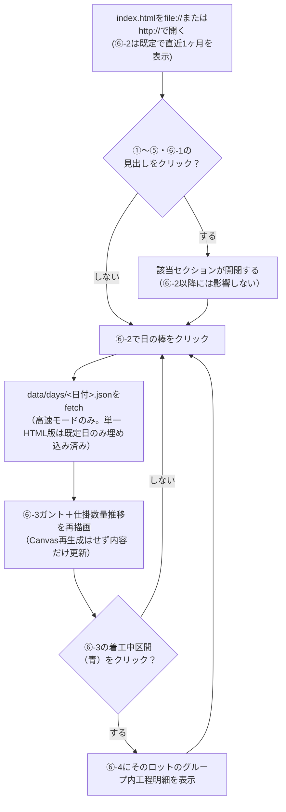
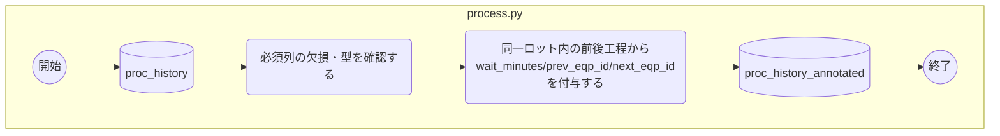
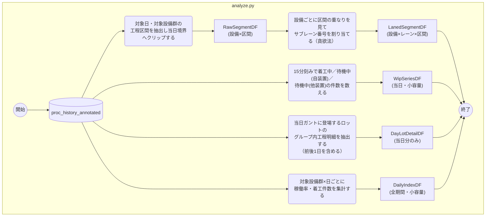
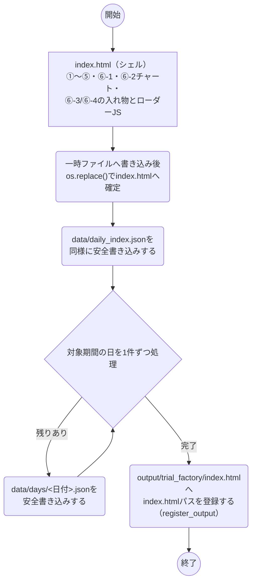
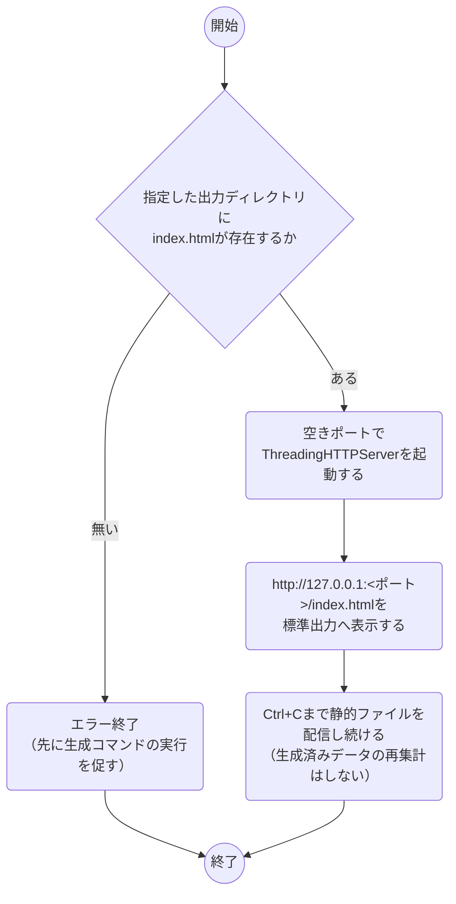
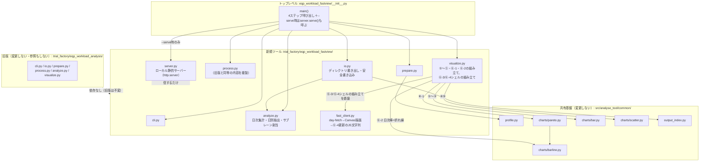

# design.md — 新規ツール `eqp_workload_fastview`（1ヶ月/1日表示・高速モード）

## 対象／構成物一覧

`eqp_workload_analysis`（旧版）のファイルは1つも変更しない。すべて
新規ツール`eqp_workload_fastview`側に新規実装する。

| 種別 | 名称 | 対応種別 | 内容 |
| --- | --- | --- | --- |
| SRC | `scripts/trial_factory/eqp_workload_fastview.py` | 新 | エントリポイント（CLI引数解析＋`main()`呼び出しの薄いラッパー） |
| SRC | `trial_factory/eqp_workload_fastview/cli.py` | 新 | 引数定義（`--serve`／`--single-file`／`--top-n`／`--input`／`--output-dir`等） |
| SRC | `trial_factory/eqp_workload_fastview/prepare.py` | 新 | EDA（`common/profile.py`の`profile_from_parquet()`を利用。旧版と同等の内容だが独立実装） |
| SRC | `trial_factory/eqp_workload_fastview/process.py` | 新 | 必須列チェック・`wait_minutes`/`prev_eqp_id`/`next_eqp_id`付与（旧版`process.py`と処理内容は重複するが複製する。理由は「課題対応」参照） |
| SRC | `trial_factory/eqp_workload_fastview/analyze.py` | 新 | ①〜⑤・⑥-1用の集計（旧版`analyze.py`の`aggregate_eqp_workload`/`build_pareto`相当を複製）＋⑥-2の日次集計・⑥-3/⑥-4の日別抽出・サブレーン割当 |
| SRC | `trial_factory/eqp_workload_fastview/visualize.py` | 新 | ①〜⑤・⑥-1を`<details>`アコーディオンで組み立て。⑥-2はPlotly（日次・全期間）。⑥-3/⑥-4はCanvasシェル＋ローダーJSの組み立て |
| SRC | `trial_factory/eqp_workload_fastview/fast_client.py` | 新 | ⑥-2の日クリック→日別JSON取得→⑥-3 Canvas描画→⑥-4表更新、を行うブラウザ側JS文字列を組み立てる（`visualize.py`の肥大化対策として分離） |
| SRC | `trial_factory/eqp_workload_fastview/server.py` | 新 | 生成済み出力ディレクトリを配信するローカル静的サーバー（標準ライブラリ`http.server`のみ、追加依存なし） |
| SRC | `trial_factory/eqp_workload_fastview/io.py` | 新 | 出力ディレクトリ（`index.html`＋`data/`）への安全書き込み（一時ファイル→`os.replace()`） |
| DAT | `data/daily_index.json`（出力データ） | 新 | ⑥-2用。全期間×対象設備群の日次集計（小容量） |
| DAT | `data/days/<YYYY-MM-DD>.json`（出力データ） | 新 | ⑥-3・⑥-4用。対象設備群×当日のガント区間・サブレーン・仕掛数量・ロット明細 |
| DOC | `docs/trial_factory/eqp_workload_fastview.md` | 新 | 本ツールの説明資料（`docs/templates/tool-doc.md`を複製） |
| DOC | `docs/product-requirements.md` | 変 | 「可視化レポートは`file://`で開ける自己完結HTML」「サーバー起動不要」を、`eqp_workload_fastview`に限る例外を明記する形に更新 |
| DOC | `docs/architecture.md` | 変 | ローカル静的サーバー配信パターンを、例外的な選択肢として追記 |
| TEST | `tests/trial_factory/eqp_workload_fastview/test_*.py` | 新 | 各モジュールのユニットテスト・結合テスト一式 |

`src/analyse_tool/common/`配下（`charts/`・`report.py`・`profile.py`・
`output_index.py`）は変更しない。`eqp_workload_fastview`から利用する
だけで、これらのファイル自体には手を入れない（既に複数ツールが使う
共有基盤のため、シグネチャ変更はしない）。

## 画面レイアウト

requirements.md承認時に共有したラフモックから、レイアウト自体の変更は
ない（confirmedとして扱う）。
https://claude.ai/code/artifact/5a4477ff-4139-4ed8-9194-2543baf8bb0b

今回の設計で確定した、モックからの差分・補足は次の3点。

1. **⑥-1パレート図は非クリック（静的）にする。** 対象設備群は常に上位N台
   のため、1台に絞り込む役割が無くなった。クリックで該当設備のガント行へ
   スクロールする等の追加操作は今回のスコープに含めない（「課題対応」
   参照）。
2. **①〜⑤は初期状態を閉、⑥-1は初期状態を開**にする（モックと同じ）。
3. **⑥-3の描画はブラウザの`<canvas>`要素**で行う（モックはラフのため
   SVGで代用していたが、見た目は変わらない。実装は`fast_client.py`が
   Canvas 2D APIで矩形を描く）。

## 画面遷移図



## 機能別処理フロー

### `process.py`（旧版と処理内容は同等・複製実装）



### `analyze.py`（⑥-2/⑥-3/⑥-4用の集計・抽出）



`Pack`（サブレーン割当）は「区間のリストを受け取りレーン番号のリストを
返す」だけの純粋関数（`assign_sublanes()`）とし、DuckDBのSQLではなく
Pythonで実装する（対象は1設備・1日分＝多くても数百区間のため、SQLに
する利点がない。ユニットテストのしやすさを優先する）。旧版のブラウザ側
JS`greedyPackLanes()`と同じ考え方をPythonへ移植する。

### `io.py`（出力ディレクトリの書き出し）



### `server.py`（高速モード起動）



## コンポーネント構成図



`common/report.py`は今回利用しない。①〜⑤は旧版と同じく`_fig_section()`
相当の直接埋め込みで組み立て、⑥-2〜⑥-4は`common/report.py`の多段
ドリルダウン機構を経由しない新しい組み立て（`fast_client.py`）にする
（「課題対応」参照）。`customer_pref_summary`・旧版`eqp_workload_analysis`
は無変更のため影響を受けない。

## 課題対応

### なぜ別ツール（新規サブパッケージ）として切り出すか

ユーザー確認済み事項として、旧版`eqp_workload_analysis`のソース・出力・
ドキュメントを一切変更しないことを優先する。⑥-2/⑥-3の表示範囲拡大は
インタラクションモデル自体の変更（1設備選択→複数設備並列表示、時間窓
クリック→日クリック、構築式→サーバー取得式）を伴い、旧版のコードへ
差分を積み重ねるより、新規ツールとして独立させたほうが旧版の安定運用
（既存の利用者への影響ゼロ）と、新ツールの実装の見通しの良さの両方を
満たせると判断した。

### 旧版と処理内容が重複するコード（`process.py`・①〜⑤/⑥-1の集計）を複製するか

**結論: 複製する。旧版ファイルをimportしない。**
`docs/development-guidelines.md`は「共通処理は`common/`に切り出す」
としつつ、`src/analyse_tool/<プロジェクト名>/common/`（プロジェクト内
共有）は「必要な場合のみ」作るものとしている。技術的には
`trial_factory/common/`へ切り出す選択肢もあるが、それには旧版
`process.py`側もそこを参照するよう書き換えが必要になり、「旧版は一切
変更しない」というユーザー確認済みの方針と矛盾する。重複するロジックは
`process.py`の列チェック・`wait_minutes`等の付与、`analyze.py`の
①〜⑤/⑥-1集計クエリのみで、いずれも数十行程度の小さいDuckDB SQLで
あるため、複製のコストは小さいと判断した。3つ目のツールが同じロジック
を必要にした時点で`trial_factory/common/`への切り出しを検討する
（旧版側の書き換えを伴う判断は、そのタイミングで改めて行う）。

### `common/`（プロジェクト横断）へ切り出すか（サブレーン割当・Canvas描画・ローカルサーバー）

**結論: 今回は`eqp_workload_fastview`のサブパッケージ内に閉じ、
`src/analyse_tool/common/`へは切り出さない。**
`docs/development-guidelines.md`の「先回りして共通化しない」方針（2つ
以上のツールで同じ組み立てパターンが必要になって初めて`common/`側への
切り出しを検討する）に従う。高速モードを使うツールが2つ目に現れた時点で、
`server.py`（起動処理）とサブレーン割当（`assign_sublanes()`）から
先に共通化を検討する（Canvas描画は表示内容がツールごとに違うため、
共通化の優先度は低い）。

### `common/report.py`の多段ドリルダウン機構を使うか

**結論: 使わない。**
`build_multi_stage_drilldown_html()`は「全データが埋め込み済みで、
クリックのたびにブラウザ側JSが同期的に絞り込む」という前提（構築式／
選択式）で作られている。⑥-2以降が非同期の`fetch()`を挟む構成になる
ため、この前提と噛み合わない。無理に対応させると1ツールのための特殊
分岐が増えて機構自体の見通しが悪くなるため、`eqp_workload_fastview`
側に新しい組み立て（`fast_client.py`）を書き、`common/report.py`は
現状のまま`customer_pref_summary`・旧版向けに残す（変更しない）。

### ⑥-2の描画方式（Plotly継続／ECharts Canvas／Custom Canvas）

**結論: 既存のPlotly（`common/charts/barline.py`）を継続する。**
性能懸念の実体は「全期間・全設備の工程明細を埋め込み、日付切替のたびに
数万〜数十万行を走査すること」であり、⑥-2自体のデータ量は日次集計
（全期間でも最大で数百行程度）に留まるため、Plotlyのままで性能目標に
支障はない。ECharts Canvas／Custom Canvas化は新規依存や実装コストに
見合わない。

### ⑥-1非インタラクティブ化への対応

⑥-1が対象設備の絞り込みをしなくなったことで「パレート図で気になる設備
を選ぶ」という導線が失われる。今回のスコープでは、⑥-1クリックで⑥-3の
該当行へスクロールする等の代替導線は実装しない（要求の受け入れ条件に
無く、実装・テストの追加コストに見合わないと判断）。次回以降の申し送り
事項とする。

### 単一HTML（`--single-file`）出力を残すか

**結論: 残すが、機能を絞る。** ①〜⑤・⑥-1・⑥-2（日次集計）はこれまで
通り全期間分をそのまま埋め込む（データ量が小さいため`file://`のままで
問題ない）。⑥-3・⑥-4は、初期表示日（稼働が最も多い日）1日分だけを
静的に埋め込み、他の日への切替はできない（レポート上部に「他の日を見る
には高速モードで起動してください」という注記を出す）。これにより
`file://`の可搬性を残しつつ、単一HTMLへ全期間の工程明細を埋め込む
という当初の性能問題を再発させない。

### 日をまたぐロットの扱い

日別JSON生成時点ではDuckDB上に全期間データがあるため、旧版の
`build_lot_records()`と同じ`boundary_buffer_days=1`の考え方で、当日
ガントに登場するロットの前後工程（別日・別設備の行を含む）をそのまま
`DayLotDetailDF`に含める。ブラウザ側は日をまたいだ問い合わせを一切
行わない（当日ファイル1本の`fetch()`だけで⑥-4まで完結する）。

### ⑥-2の日時表現

`start_min`/`end_min`（当日0時からの経過分）のような数値表現は⑥-3の
区間データに用いる。⑥-2の日次集計は行数が少ないため、可読性を優先して
`YYYY-MM-DD`文字列のまま保持する（添付ファイルの「日時は圧縮しやすい
数値表現を用いる」は⑥-3・⑥-4向けの指針として採用し、⑥-2には過剰
最適化のため適用しない）。

## 追加設計（2026-09-01 最終報告後：⑥-3ズーム・スクロール）

requirements.mdの「追加要件」を受けた実装方式。既存の⑥-3実装
（`fast_client.py`）に対する変更のみで、`analyze.py`が返す日別データ
（`segments`/`wip`）の形は変えない（ズーム・パンはブラウザ側の表示範囲
の解釈だけを変える、クライアントサイドの機能）。

### 状態と座標変換

`renderGantt`が使っていた「0〜1440分固定」の座標変換を、表示範囲
`[viewStart, viewEnd]`（分、初期値`[0, 1440]`）を使う変換へ置き換える。

```
x = ((seg.start_min - viewStart) / (viewEnd - viewStart)) * width
```

`viewStart`/`viewEnd`はモジュールスコープの状態とし、日切替時
（`selectDay`が新しいpayloadを`applyPayload`する際）に`[0, 1440]`へ
リセットする。表示幅の下限・上限は`MIN_WINDOW_MIN = 30`（30分）・
`MAX_WINDOW_MIN = 1440`（1日）とし、`viewEnd - viewStart`をこの範囲へ
クランプする。パン時も`viewStart >= 0`・`viewEnd <= 1440`の範囲内へ
クランプし、日の外側は表示しない。

### 描画対象の絞り込み（画面外は描画しない）

`renderGantt`は`[viewStart, viewEnd]`と重ならない区間をループの先頭で
スキップし、`fillRect`・`hitList`への追加のいずれも行わない。ズームで
表示区間が狭まるほど描画・ヒットテスト対象が減るため、性能面でも有利
（タスクリストの「画面外は描画しない」はここで初めて意味を持つ。
非ズーム時は全区間が画面内のため、これまでは実質的にスキップが発生
しなかった）。

### 目盛（axis）の動的化

現状`visualize.py`の`_build_axis_ticks_html()`がサーバー側で「4時間
おき固定」の目盛HTMLを生成しているが、ズーム後は固定間隔が不適切
（狭い範囲で1本も出ない、または広すぎる）。`_build_axis_ticks_html()`
は削除し、目盛は`fast_client.py`が`renderAxis(viewStart, viewEnd)`
として毎回動的に生成する（`gantt-labels`と同じく既にJS側がDOMを
組み立てている領域なので、責務がそろう）。

目盛間隔は表示幅に応じて次の候補（分）から「目盛本数が4〜10本に収まる
最小のもの」を選ぶ簡易ロジックとする: `[5, 10, 15, 30, 60, 120, 240,
360, 720, 1440]`。初期表示（1日分）では現状と同じ`240`（4時間おき）が
選ばれる。

### ホイールズーム

`gantt-canvas`に`wheel`イベントリスナーを追加する。`evt.deltaY`が負
（上スクロール）なら拡大、正なら縮小とし、`evt.preventDefault()`で
ページスクロールを抑止する（キャンバス領域内のみ）。カーソルのX座標を
現在の変換で時刻へ逆変換し、その時刻を中心に`viewStart`/`viewEnd`の
幅を一定倍率（例: 1.2倍/回）で拡大・縮小してからクランプする。

### ドラッグパン／クリックの区別

`mousedown`で開始座標を記録するだけに留め、その時点では何もしない。
`mousemove`（ボタン押下中）で移動量が閾値（4px）を超えた時点で
「パン中」に切り替え、以降は移動量を時間幅へ換算して`viewStart`/
`viewEnd`を平行移動する（都度クランプ・再描画）。`mouseup`時、一度も
「パン中」に切り替わっていなければ、従来どおり`findHit`によるロット
選択処理を行う。パン中に切り替わった場合はロット選択を行わない。

### ダブルクリックでリセット

`dblclick`で`viewStart=0`・`viewEnd=1440`に戻し再描画する。

### 仕掛数量推移（WIP）グラフとガントのズーム連動（2026-09-02改訂）

**当初の結論（撤回済み）**: WIPグラフは「1日の全体感を保つアンカー」
として常に全日表示のままにし、ズーム対象外とする方針だった（ガントと
WIPのどちらが今どの範囲を見せているか分かりにくくなる懸念のため）。

**改訂後の結論**: ユーザーから「ズーム・スクロールタイムラインと仕掛
数量グラフが同期して動作するようにしてほしい」と明示的な指示があり、
上記の懸念より同期表示の価値を優先する形に方針を変更した。WIPグラフも
ガントと同じ`viewStart`/`viewEnd`（表示範囲）を使って再描画する
（`renderWip()`のX軸を`wip.t_min / 1440`固定から
`(wip.t_min - viewStart) / (viewEnd - viewStart)`へ変更）。

- **X軸（時間軸）**: ガントと完全に同期する。ズーム・パン・
  ダブルクリックリセットのたびに`renderGantt()`・`renderAxis()`と
  同じタイミングで`renderWip()`も呼び直す。
- **Y軸（数量）**: 同期させない。1日全体（96バケット全部）から求めた
  最大値で固定し、ズームしても縦方向のスケールは変えない。ズームの
  たびに縦軸が伸縮すると「今見ている範囲は1日全体の中でどれくらい
  多いか」という relative な情報が失われるため。
- **視覚的な整列**: ガント本体は`.gantt-body-row`で左側に140pxの設備
  ラベル列を持つため、WIPグラフ側にも同じ`140px 1fr`グリッド
  （`.wip-body-row`、左セルは空）を導入し、両グラフの横方向ピクセル
  位置がページ上でも一致するようにする（同期しているのにX座標がずれて
  見えると、かえって同期の効果が伝わらないため）。
- **目盛線**: WIPグラフにもガントと同じ`ticksInView()`基準の縦グリッド
  線を薄く描く（時間の対応が視覚的にも分かりやすくなる）。
- **データ解像度の限界**: WIPは15分刻み（`WIP_BUCKET_MINUTES`）で
  サンプリング済みのデータのため、最小表示幅（30分）までズームすると
  WIPグラフの折れ線は2〜3点しかなく直線的に見える。これはデータ生成
  側の粒度によるものであり、今回の同期対応のスコープには含めない
  （必要になった場合はズーム時のみ15分未満の粒度でWIPを再集計する等、
  別途設計が要る）。

### テスト方針

`assign_sublanes()`のような純粋関数への切り出しが難しい（ブラウザの
`wheel`/`mousemove`イベント・実際のCanvas座標が前提のロジックのため）。
既存の`test_fast_client.py`と同じ方針（生成されたJS文字列に、ズーム・
パン・リセットに必要な識別子・イベント名が含まれることを検証する
文字列ベースのテスト）を踏襲する。実際の操作結果（ホイール後に表示
範囲が変わる、ドラッグでパンする等）は、性能実測で使ったPlaywright
スクリプトと同じ手段で動作確認し、`tasklist.md`に結果を記録する
（プロジェクトの正式なテストスイートには追加しない。Playwrightは
本セッション限定の一時セットアップであり`pyproject.toml`には追加して
いないため）。

## 追加設計2（2026-09-02：⑥-3縦寸法の縮小）

`ROW_HEIGHT_PX`/`ROW_GAP_PX`/`EQP_GAP_PX`（22/3/8）を`5/1/2`へ変更する
（線形の高さ計算式のため、いずれの設備・レーン数でも総高さがおよそ1/4に
なる）。設備ラベルは`<span>`2行（ID＋サブレーン数）から`textContent`1行
（IDのみ）に簡略化し、サブレーン数は`title`属性（ネイティブのホバー
ツールチップ）へ退避する。ラベルのCSSに`overflow:hidden;
white-space:nowrap; text-overflow:ellipsis;`を追加し、縮小後の行高でも
文字がはみ出さないようにする。

## 追加設計3（2026-09-02：装置ステータス背景）

### 算出方法（クライアント側、新規データ不要）

`analyze.py`・日別JSON（`data/days/<日付>.json`）の形は変更しない。
ある設備の「稼働中区間」は、その設備の全サブレーンの区間
（`start_min`/`end_min`）の**和集合**として定義する（1本でも重なれば
Processing）。`fast_client.py`に純粋関数`mergeIntervals(pairs)`を追加し、
開始時刻順にソートしてから重なる・隣接する区間を1本へ結合する。結合後の
リストの「隙間」が自動的にWaiting区間になる（明示的な引き算は不要で、
背景をまずWaiting色で全面塗りし、その上からProcessing区間だけ塗り直す
実装にする）。

### 描画順序

`renderGantt()`内で、(1) 設備ごとの背景（Waiting全面→Processing区間で
上書き）→ (2) 目盛線 → (3) ラベル・区間バー、の順に描く。区間バー
（`COLOR_BUSY`）が背景の一番上に乗ることで視認性を確保する。背景は
設備ブロックの高さ（`laneCounts[i] * (ROW_H + ROW_GAP)`。末尾の
`EQP_GAP`は含めない）で塗り、設備間の隙間（`EQP_GAP`）は素の背景色の
ままにして設備ごとの区切りを保つ。

### 配色

`COLOR_STATUS_PROCESSING = "#dceefb"`（淡い青。区間バーの`#1f77b4`より
明度・彩度を大きく落とし、バーが背景に埋もれないようにする）、
`COLOR_STATUS_WAITING = "#eef0f2"`（淡いグレー。既存の`COLOR_WAIT`
[`#d3d3d3`、現状未使用]より明るくし、背景と分かるが主張しすぎない色に
した）。凡例を⑥-3のヒントの下に追加する。

### 「稼働中(Processing)」ステータス欄クリック時の挙動

ステータス背景そのものはクリック対象にしない（クリック判定
`findHit()`はhitList＝区間バーのみを対象とし、変更しない）。

### 将来のStop（設備停止）ステータスへの拡張

`proc_history`に停止理由・ダウンタイム情報が無いため今回は実装しない
（旧版`eqp_workload_analysis`の説明資料にも同じ理由で「故障」ステータス
を対象外とした記載がある）。将来追加する場合は、`mergeIntervals()`の
結果（Processing区間）に加えてStop区間のリストを別途持たせ、
背景描画のfillStyle選択を2値から3値の判定に拡張する形になる見込み
（Waiting→Processing→Stopの優先順位や、Processing/Stopが同時刻に
重なるケースの扱いは、実装するデータが揃った時点で改めて設計する）。

## 追加設計4（2026-09-02：⑥-3仕掛数量推移の修正）

### Y軸目盛の追加

`renderWip()`が計算する`maxTotal`（1日全体の最大値）を使い、
`renderWipAxisLabels(maxTotal)`が0・中間値・最大値の3点を
`#wip-axis`（`.wip-body-row`の左140px列。ガントの設備ラベル列と同じ
グリッド位置）へHTML要素として描画する（Canvas内テキスト描画より
鮮明で、既存の`renderAxis()`と同じ「軸はHTML、データはCanvas」という
方針に揃う）。

### 待機中カテゴリの二重計上バグ

**症状**: `build_day_wip_series()`に複数の対象設備（例: 上位N台の
パレート対象）を渡すと、あるロットが対象設備群内の設備Aから設備Bへ
移動する際の待機時間が、Aの退出側で「待機中(他装置着工)」、Bの到着側で
「待機中(自装置着工)」の**両方**にカウントされ、その瞬間の仕掛数量
（`busy+wait_self+wait_other`の合計）が実際のロット数より多くなる。

**原因**: `wait_other`を算出する`next_row` CTEの`WHERE`句が
`t.next_eqp_id <> t.eqp_id`（＝移動先が今と違う設備）だけを条件にして
おり、「移動先が対象設備群に含まれるかどうか」を見ていなかった。一方
`wait_self`は「対象設備群のどれかに到着する待機」を無条件に数えるため、
移動先も対象設備群に含まれるケースは両方に該当してしまう。

**修正**: `next_row`のWHERE句に`AND t.next_eqp_id NOT IN
({eqp_list_sql})`を追加し、移動先が対象設備群の外（＝追跡対象から
出ていく場合）のときだけ`wait_other`としてカウントするようにした。
`wait_self`（到着待ち、無条件）と`wait_other`（対象設備群の外へ出る
退出待ちのみ）で守備範囲が排他的になり、二重計上が無くなる。

**検証**: `E1→E2`（両方を対象設備群に指定）という最小ケースで、修正前は
該当時刻の`wait_self=1`かつ`wait_other=1`（合計2、実際のロットは1件）
だったのが、修正後は`wait_self=1`・`wait_other=0`（合計1）になることを
手動検証・`test_analyze.py`への回帰テスト追加の両方で確認した。

## 追加設計5（2026-09-02 ユーザー指示：待機中カテゴリの統合）

「待機中の区分を一つに統合してほしい」との指示を受け、待機中(自装置
着工待ち)／待機中(他装置着工待ち)の2区分を「待機中」1区分へ統合した。

- **`analyze.py`**: `build_day_wip_series()`の戻り列を
  `busy`/`wait_self`/`wait_other`（3列）から`busy`/`wait`（2列）へ
  変更。SQLは従来どおり2つのサブクエリ（着工待ち・退出待ち。追加設計4
  の修正で既に排他的）を計算し、それらを`SELECT`句内で`+`して1列に
  まとめるだけに留めた（二重計上修正のロジック自体は変更していない。
  排他的な2つの数を単純加算するだけなので正しさは変わらない）。
- **`visualize.py` / `fast_client.py`**: `build_day_payload()`の
  `wip`辞書を`t_min`/`busy`/`wait`の3キーに変更。`COLOR_WAIT_SELF`
  （橙）・`COLOR_WAIT_OTHER`（緑）は削除し、既存の`COLOR_WAIT`
  （グレー。旧版由来でガント側では現状未使用）を仕掛数量推移の
  「待機中」帯に転用した。積み上げは着工中→待機中の2バンドになる。
  凡例・タイトル文言も2分類に合わせて修正した。
- **影響範囲の確認**: `wait_self`/`wait_other`という名前・配色は
  ⑥-3仕掛数量推移だけで使っており、⑥-3ガントの区間バー
  （`COLOR_BUSY`/`COLOR_WAIT`）・装置ステータス背景
  （`COLOR_STATUS_PROCESSING`/`COLOR_STATUS_WAITING`）とは独立した
  別の色定数だったため、他機能への副作用は無い。

## 残課題

- `--top-n`の既定値（旧版は15）を踏襲するか。踏襲する前提で進めるが、
  `tasklist.md`着手前に性能実測（受け入れ条件の100ms/300ms目標）で
  問題があれば見直す。
- ローカルサーバーのポート番号は`0`指定によるOS自動割当とする想定。
  固定ポートを希望する運用があるかは、実装時に`--port`オプションの
  要否として確認する。
- `docs/product-requirements.md`／`docs/architecture.md`の具体的な
  文面（例外の書き方）は、実装が固まった後の最終ドラフトで再確認する。
