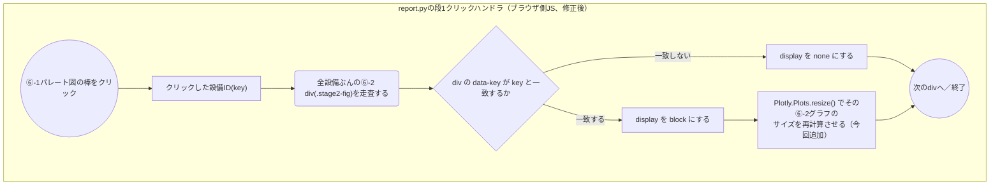

# design.md — ⑥-2装置稼働グラフの表示幅不整合バグ修正の設計

## 対象

### 構成物一覧

| 種別 | 名称 | 対応種別 | 内容 |
| --- | --- | --- | --- |
| SRC | `src/analyse_tool/common/report.py` | 変 | 段1→段2のクリックハンドラで、対象の⑥-2グラフを`display:block`にした直後にPlotlyへ再計算を指示する処理（`Plotly.Plots.resize()`）を追加する |
| SRC | `tests/common/test_report.py` | 変 | 表示切替時に上記のリサイズ呼び出しが生成HTMLへ埋め込まれることを確認するテストを追加する |

## 画面レイアウト

グラフの種類・軸・配色など⑥-2の見た目仕様自体は変更しない
（`docs/trial_factory/eqp_workload_analysis.md`記載の仕様のまま）。
今回直すのは「初期選択設備以外に切り替えたときの表示幅」のみのため、
新たな画面レイアウト図は起こさない（`requirements.md`の
「画面イメージ（現状→修正後）」を参照）。

## 画面遷移図

既存の遷移から変更なし（`.steering/20260830-eqp-workload-analysis/design.md`
の画面遷移図の通り）。①〜⑤常時表示 → ⑥-1パレート図クリックで⑥-2選択
→ ⑥-2クリックで⑥-3構築 → ⑥-3クリックで⑥-4構築、という段構成・
トリガー条件のいずれも変えない。

## 機能別処理フロー

今回の修正は`report.py`が生成する共通テンプレート内、段1（パレート図）
クリック時の段2表示切り替え処理（ブラウザ側JS）に閉じる。

- 「その⑥-2グラフ」＝`.stage2-fig`要素内の`.plotly-graph-div`
  （既存の段2→段3クリック監視コードと同じセレクタを再利用する）。
- 非表示側（`display:none`にする方）へはリサイズを呼ばない
  （呼んでも意味が無く、クリックのたびに不要な再計算コストが増えるため）。
- 初期選択設備（`stage2_default_key`）は最初から`display:block`で
  `Plotly.newPlot()`が呼ばれるため、この処理の対象外のままで良い
  （実データでも初期選択設備は現状すでに正しい幅で描画されることを
  確認済み）。

## コンポーネント構成図

変更なし。`.steering/20260830-eqp-workload-analysis/design.md`記載の
構成図の通りで、モジュール間のimport関係に変更は無い（今回の修正は
`report.py`が生成するJS文字列テンプレートの中身のみの変更であり、
Pythonモジュール間の依存関係は増減しない）。

## 課題対応

- **`display:block`にした直後に同期で`Plotly.Plots.resize()`を呼んで
  正しく機能するか**（`display:none`→`block`直後はレイアウト未確定
  ではないか）→ ブラウザは`getBoundingClientRect()`等レイアウト依存の
  プロパティを読む際に同期的にreflowを行うため、`Plotly.Plots.resize()`
  内部のサイズ計測は直後の呼び出しでも正しい値を取得できる。これは
  「非表示コンテナで初期化したPlotlyグラフを、表示後に手動で
  `Plotly.Plots.resize()`する」というPlotly.js自体でも案内されている
  定番の対処法であり、追加の遅延（`requestAnimationFrame`等）は不要と
  結論づける。
- **`config`の`{"responsive": true}`だけでは解決しないのか** →
  `responsive: true`は主にウィンドウリサイズ等のブラウザイベントへの
  追従用で、`display:none`→`block`のようなプログラムによる表示切り替え
  には自動追従しない（実際に今回のバグが再現している）。そのため
  `responsive`設定はそのまま残しつつ、表示切り替え側で明示的に
  `resize()`を呼ぶ対応とする。
- **描画確認の方法**（本開発環境にはブラウザ実行環境が無い）→
  `tests/common/test_report.py`に生成HTML文字列へ`Plotly.Plots.resize`
  呼び出しが埋め込まれていることを確認する文字列レベルのテストを追加する。
  実際のブラウザでの見た目確認は、ユーザー側で実データレポートを開いて
  ⑥-1の複数設備をクリックし目視確認してもらう（受け入れ確認）。

## 残課題

なし。実装内容は本ファイルの内容で確定しており、`tasklist.md`着手前に
追加で決めるべき事項は無い。
