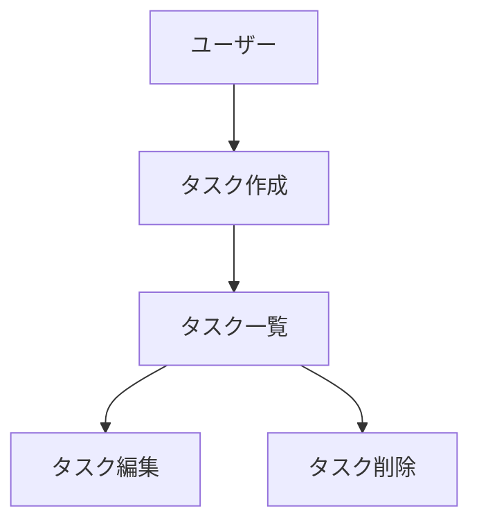

# 図表・ダイアグラムの記載ルール

## 記載場所

設計図やダイアグラムは、関連する永続的ドキュメント内に直接記載します。
独立した diagrams フォルダは作成せず、手間を最小限に抑えます。

**配置例:**

| 図の種類 | 記載先 |
| --- | --- |
| ER図、データモデル図 | `docs/functional-design.md` |
| ユースケース図 | `docs/functional-design.md` または `docs/product-requirements.md` |
| 画面遷移図、ワイヤフレーム | `docs/functional-design.md` または `docs/product-requirements.md` |
| システム構成図 | `docs/functional-design.md` または `docs/architecture.md` |

## 記述形式

### 1. Mermaid記法（推奨）
- Markdown に直接埋め込める
- バージョン管理が容易
- ツール不要で編集可能



#### アクティビティ図（処理順序図）の描き方

Mermaidに専用の「アクティビティ図」記法（UML Activity Diagram）は無いため、
`flowchart`を次の約束で代用する。呼び出し関係（import の方向）を表す図とは
別物であり、混在させない（呼び出し関係は別の図として書く）。

| UMLの要素 | Mermaidでの表現 |
| --- | --- |
| 開始・終了ノード | `id((開始))` / `id((終了))` の円 |
| アクション（処理） | `id[処理名]`（角丸長方形が望ましいが、Mermaidの制約上、長方形で統一してよい） |
| データ・成果物（オブジェクトノード） | `id[/データ名/]`（平行四辺形）。**処理ノードと同じ形にしない**。矢印のラベルに出力名を書くだけで済ませず、量が多いデータや後続で参照するデータは独立したノードにする |
| 分岐 | `id{条件}`（ひし形） |
| フォーク／ジョイン | 専用記法は無い。1つのノードから複数の矢印が出ている＝フォーク、複数の矢印が1つのノードに集まる＝ジョイン、という約束で表現し、図の直前か凡例で一度だけ断る |
| スイムレーン（担当モジュール） | `subgraph` |

矢印は「この後どの処理を行うか」という順序のみを表す。図中に業務上の記号
（①②③等）を使う場合は、その番号が何を指すか（別ドキュメントの章・画面
セクション番号など）を図の直前に必ず明記する。

### 2. ASCIIアート
- シンプルな図表に使用
- テキストエディタで編集可能

```
+-----------+
|  Header   |
+-----------+
      |
      v
+-----------+
| Task List |
+-----------+
```

### 3. 画像ファイル（必要な場合のみ）
- 複雑なワイヤフレームやモックアップ
- `docs/images/` フォルダに配置
- PNG または SVG 形式を推奨

## 図表の更新

- 設計変更時は対応する図表も同時に更新
- 図表とコードの乖離を防ぐ
- 図表は必要最小限に留め、メンテナンスコストを抑える
