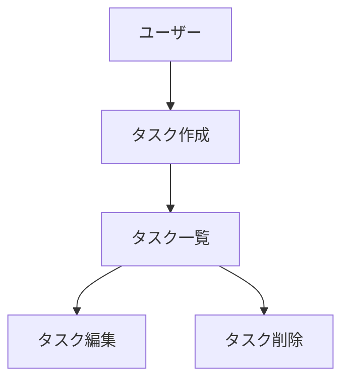

# 図表・ダイアグラムの記載ルール

## 記載場所

設計図やダイアグラムは、関連する永続的ドキュメント内に直接記載します。
独立した diagrams フォルダは作成せず、手間を最小限に抑えます。

**配置例:**

| 図の種類 | 記載先 |
| --- | --- |
| ER図、データモデル図 | `docs/functional-design.md` |
| ユースケース図 | `docs/functional-design.md` または `docs/product-requirements.md` |
| 画面遷移図、ワイヤフレーム | `docs/functional-design.md` または `docs/product-requirements.md` |
| システム構成図 | `docs/functional-design.md` または `docs/architecture.md` |

## 記述形式

### 1. Mermaid記法（推奨）
- Markdown に直接埋め込める
- バージョン管理が容易
- ツール不要で編集可能



### 2. ASCIIアート
- シンプルな図表に使用
- テキストエディタで編集可能

```
+-----------+
|  Header   |
+-----------+
      |
      v
+-----------+
| Task List |
+-----------+
```

### 3. 画像ファイル（必要な場合のみ）
- 複雑なワイヤフレームやモックアップ
- `docs/images/` フォルダに配置
- PNG または SVG 形式を推奨

## 図表の更新

- 設計変更時は対応する図表も同時に更新
- 図表とコードの乖離を防ぐ
- 図表は必要最小限に留め、メンテナンスコストを抑える
