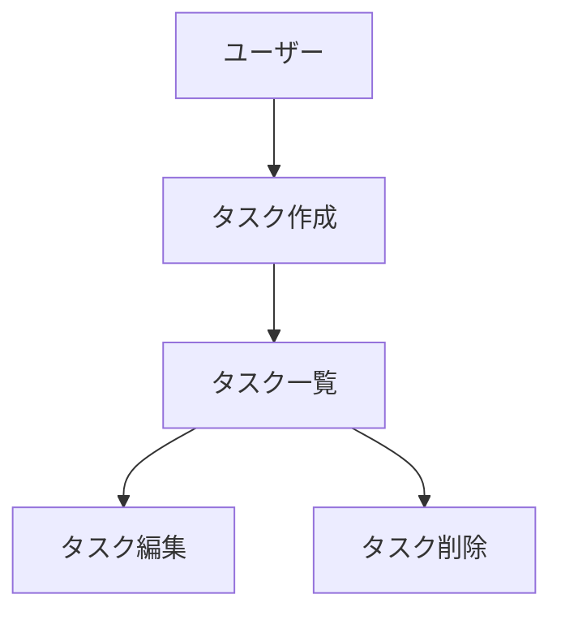

# 図表・ダイアグラムの記載ルール

## 記載場所

設計図やダイアグラムは、関連する永続的ドキュメント内に直接記載します。
独立した diagrams フォルダは作成せず、手間を最小限に抑えます。

**配置例:**

| 図の種類 | 記載先 |
| --- | --- |
| ER図、データモデル図 | `docs/functional-design.md` |
| ユースケース図 | `docs/functional-design.md` または `docs/product-requirements.md` |
| 画面遷移図、ワイヤフレーム | `docs/functional-design.md` または `docs/product-requirements.md` |
| システム構成図 | `docs/functional-design.md` または `docs/architecture.md` |
| アクティビティ図（処理順序図） | `.steering/*/design.md`（「機能別処理フロー」） |
| コンポーネント構成図（呼び出し関係） | `.steering/*/design.md`（「コンポーネント構成図」） |

上4種は完成後に価値が変わらない永続的ドキュメント側の図、下2種は個別の
作業単位ドキュメント（`design.md`）側の図。**描き方はどちらも本ファイルが
一元的に定める**（後述の「Mermaid記法」参照）。置き場所が違うだけで、
描き方のルールを2箇所に分けて管理しない。

## 記述形式

### 1. Mermaid記法（推奨）
- Markdown に直接埋め込める
- バージョン管理が容易
- ツール不要で編集可能



#### アクティビティ図（処理順序図）の描き方

Mermaidに専用の「アクティビティ図」記法（UML Activity Diagram）は無いため、
`flowchart`を次の約束で代用する。呼び出し関係（import の方向）を表す図とは
別物であり、混在させない（呼び出し関係は次項「コンポーネント構成図の
描き方」で別の図として書く）。

| UMLの要素 | Mermaidでの表現 |
| --- | --- |
| 開始・終了ノード | `id((開始))` / `id((終了))` の円 |
| アクション（処理） | `id(処理名)`（角丸/スタジアム形） |
| データ・成果物（DBから取得予定のもの） | `id[(データ名)]`（円柱＝データベース/ファイルストアの慣用表現）。DuckDBで`read_parquet()`するような、外部に永続化された取得元のみに使う |
| データ・成果物（それ以外。加工結果・中間データ・出力ファイル等） | `id[データ名]`（長方形） |
| 分岐 | `id{条件}`（ひし形） |
| フォーク／ジョイン | 専用記法は無い。1つのノードから複数の矢印が出ている＝フォーク、複数の矢印が1つのノードに集まる＝ジョイン、という約束で表現し、図の直前か凡例で一度だけ断る |
| スイムレーン（担当モジュール） | `subgraph` |

矢印は「この後どの処理を行うか」という順序のみを表す。図中に業務上の記号
（①②③等）を使う場合は、その番号が何を指すか（別ドキュメントの章・画面
セクション番号など）を図の直前に必ず明記する。

**ノード内のテキストは、関数名・SQL・具体的なロジックを書き込まず、
「何をするか」を短い日本語で端的に表す。** 関数名や実装の詳細（SQLの
組み方、集計列の内訳等）は、図の直後の本文側に書く。ノードを詳細な
擬似コード置き場にしない。

**図と、その直後の本文の対応が一目で分かるようにする。** 本文でノードの
説明をする際は、ノードのラベルを意訳せず**そのまま引用**する
（例:「「傾向を把握する」＝`profile_from_parquet()`（...）」）。図の
ラベルと本文の言い回しがずれると、どの文がどのノードの説明か読み手が
探すことになる。

#### コンポーネント構成図（呼び出し関係）の描き方

モジュール間のimport方向を表す図。アクティビティ図と同じ`flowchart`記法を
使うが、**ノードの意味づけはしない**（円・スタジアム形・ひし形の使い分けは
アクティビティ図だけの約束であり、ここでは持ち込まない）。矢印は「この後
どの処理を行うか」ではなく「どちらがどちらをimportするか」を表す点が
アクティビティ図との違い。

| 要素 | Mermaidでの表現 |
| --- | --- |
| モジュール・ファイル | `id["モジュール名<br/>役割を短く"]`（角括弧の長方形。形状で区別しない） |
| 層・レイヤーのまとまり | `subgraph`（`第1層`「第2層」のように層の名前をタイトルにする） |
| import方向 | `-->`。何のために参照するかを添える場合は`-->|"⑥-1 パレート図"|`のように矢印にラベルを付ける |

依存は基本的に**上位層→下位層の一方向**で描く（`docs/architecture.md`の
関心の分離方針に合わせる）。実例は
`docs/templates/design.md`の「コンポーネント構成図」を参照。

#### システム構成図の描き方

利用者・実行環境・永続化されたファイル（Parquet/HTML等）の関係を表す図。
`flowchart`を使い、データストアはアクティビティ図と同じ**円柱
`id[(データ名)]`**で表す（「外部に永続化された取得元／書き出し先」という
意味づけを両方の図で揃えるため）。矢印には手段や操作をラベルとして添える
（例: `-->|"uv run python scripts/*.py"|`）。実例は
`docs/functional-design.md`の「システム構成図」を参照。

#### ER図・データモデル図の描き方

Mermaid専用記法をそのまま使う。`flowchart`で代用しない。

- **`erDiagram`**: Parquet/DuckDBのテーブルなど、永続化されたデータの
  テーブル間関係（外部キー相当）を表す場合に使う
  （例: `customers ||--o{ orders : "customer_id"`）。
- **`classDiagram`**: `DatasetProfile`のような、テーブルではないメモリ上の
  データ構造・スキーマの属性一覧と関係を表す場合に使う。

どちらを使うか迷う場合、対象がDuckDBの行として問い合わせられる
（テーブル/リレーション）なら`erDiagram`、Pythonのオブジェクト・JSON構造
であれば`classDiagram`を選ぶ。実例は`docs/functional-design.md`の
「データモデル定義（ER図含む）」を参照。

#### ユースケース図・画面遷移図・ワイヤーフレームの描き方

本リポジトリのツールは伝統的なUIを持たない自己完結HTMLレポートのため、
ユースケース図の代わりに**「レポートHTMLの操作フロー」**として`flowchart`
で描く。利用者の選択・分岐は`id{条件}`（ひし形）で表し、分岐先の矢印に
選んだ内容をラベルで添える（例: `-->|1段目|`）。実例は
`docs/functional-design.md`の「ユースケース図、画面遷移図、ワイヤフレーム」
を参照。

画面のレイアウト（どこに何が並ぶか）そのものを示したいワイヤーフレームは、
Mermaidのフローチャートでは表現しづらいため、次項「2. ASCIIアート」または
「3. 画像ファイル」を使う（`.steering/*/requirements.md`・`design.md`の
「画面イメージ」はこちらが多い）。

### 2. ASCIIアート
- シンプルな図表に使用
- テキストエディタで編集可能

```
+-----------+
|  Header   |
+-----------+
      |
      v
+-----------+
| Task List |
+-----------+
```

### 3. 画像ファイル（必要な場合のみ）
- 複雑なワイヤフレームやモックアップ
- `docs/images/` フォルダに配置
- PNG または SVG 形式を推奨

## 図表の更新

- 設計変更時は対応する図表も同時に更新
- 図表とコードの乖離を防ぐ
- 図表は必要最小限に留め、メンテナンスコストを抑える
