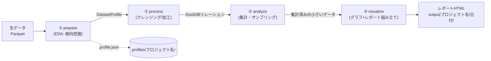
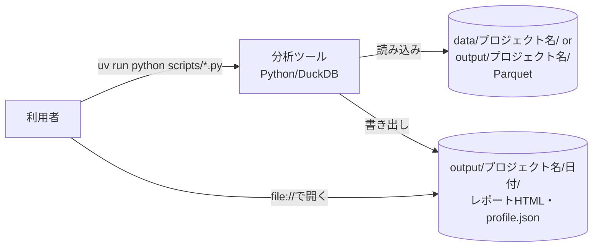
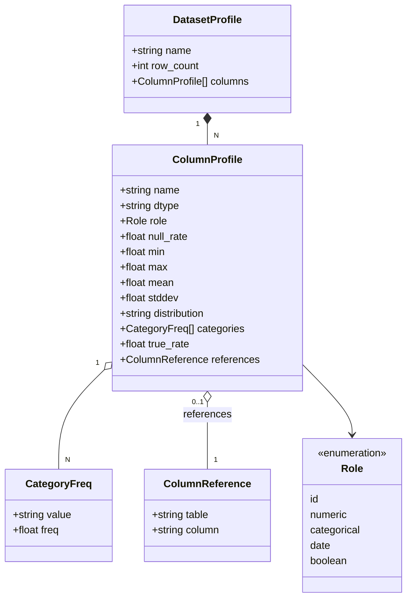
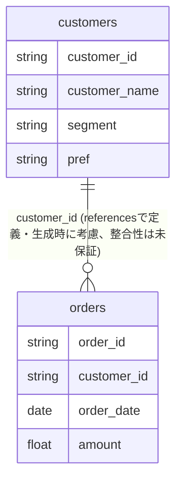
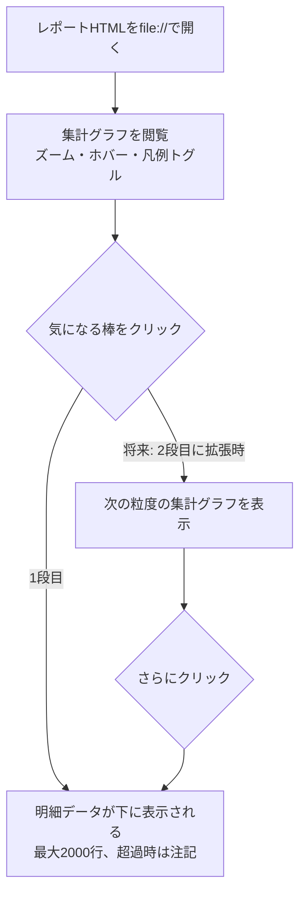

# 機能設計書

## 機能ごとのアーキテクチャ

各分析ツールは、`prepare`（前準備/EDA）→`process`（データ加工）→`analyze`
（分析）→`visualize`（可視化）の4ステップに分割する。ステップ間は「データを
受け取り、加工済みのデータを返す」関数として繋がり、互いの実装を意識しない。

例外として、`generate_sample_data`のように実データを分析するのではなく
「データそのものを作る」ツールは、この4ステップに強引に当てはめず
`cli.py`/`io.py`/生成ロジック本体、という3モジュール構成にする
(対象範囲は`docs/product-requirements.md`、命名規則は`docs/repository-structure.md`
を参照)。

## システム構成図

サーバーを持たないローカル完結のCLIツール群。ネットワーク通信は行わない。

- 将来`dbt`を導入した場合も、dbtはDuckDB上のSQL変換層として組み込む想定で、
  外部公開するAPI・サーバーは持たない（システム構成自体は変わらない）。

## データモデル定義（ER図含む）

### プロファイル（`DatasetProfile`/`ColumnProfile`）

分析対象データの「傾向」を表す共通フォーマット。`prepare.py`（実データから
`profile_from_parquet()`で自動生成）と`generate_sample_data`（プロファイルを
入力にサンプルデータを生成）の間の共通契約になっている。

現状は**単一テーブル前提**（`profiles/<プロジェクト名>/customers.json`、
`profiles/<プロジェクト名>/orders.json`のように、テーブルごとに独立した
プロファイル）。これに対し、`ColumnProfile`に
他テーブルの列を指す`references`（`ColumnReference{table, column}`）を追加し、
外部キーに相当する関係を**プロファイル上では定義できる**ようにする（例:
`orders.customer_id`に`references: {table: "customers", column: "customer_id"}`
を設定する）。

**今回のスコープ**: この定義を**サンプルデータ生成が考慮する**（参照先テーブル
の生成結果から値を選ぶ等、実態に近いデータを作る）ところまでを対象とし、生成後
に参照整合性を検証・保証する（全件が実在するかを確認する）ところまでは対象外
とする（`docs/product-requirements.md`の「今後の拡張予定」を参照）。

この対応により、`generate_sample_data`は現状の「プロファイル1つ→Parquet1つ」
という単純な1:1変換ではなく、**依存関係のあるプロファイル群をまとめて受け取り、
参照先→参照元の順で生成する**形に拡張する必要がある（具体的なCLI・入出力の形
は実装時に設計する）。

## コンポーネント設計

### `common/charts/`の層構造（見た目の型／分析の型）

`common/charts/`配下のグラフモジュールは、次の2層に分けて設計する
（`eqp_workload_analysis`の設計時（`.steering/20260830-eqp-workload-analysis/design.md`）
に確定した方針。以降に追加するグラフもこれに従う）。

- **第1層（見た目の型）**: 「棒＋第2軸の折れ線」「積み上げ面」「区間の水平棒」
  といった、描画そのものの型。`DataFrame`等を受け取って`go.Figure`を返す
  関数に加え、`twograph.py`のように複数の型を1つのFigure（subplot）に
  まとめたい場合のために「既存の`fig`にtraceを追加する関数」
  （例: `add_gantt_traces(fig, row, col, ...)`）も持たせる。
- **第2層（分析の型）**: 「降順ソート＋累積構成比＋80%目安線」（パレート図）
  や「x軸を共有する2段組」（twograph）といった、集計データの見せ方の
  作法。実際の描画は第1層に委譲し、自分では`go.Figure`を組み立てない。
- **依存は上位層→下位層の一方向のみ**。第1層同士・第2層同士に依存関係を
  作らない（同じ理由の重複実装を防ぐため。例: パレート図と装置稼働系の
  グラフは同じ「棒＋第2軸の折れ線」なので、どちらも第1層の
  `barline.py`に委譲し、二重実装しない）。
- ツール固有の「どのグラフをどの段に置くか」は各ツールの`visualize.py`
  が持ち、`common/`には持ち込まない（`visualize.py`の肥大化対策は
  `docs/development-guidelines.md`を参照）。

### 共通コンポーネント（`common/`）

| モジュール | 層 | 役割 | 状態 |
| --- | --- | --- | --- |
| `common/profile.py` | - | `DatasetProfile`/`ColumnProfile`の定義、保存・読込、`profile_from_parquet()` | 実装済み |
| `common/report.py` | - (ドリルダウン機構) | グラフ＋クリック連動明細表をまとめた自己完結HTMLの組み立て。各段は1つの`go.Figure`を渡す想定（複数グラフを1段にまとめたい場合は、その合成自体を第2層のchartモジュール側の責務とし、`report.py`側では特別扱いしない） | 実装済み。既存の1段版`build_bar_click_detail_html()`に加え、`build_multi_stage_drilldown_html()`でN段（選択式／構築式）のドリルダウンに対応 |
| `common/output_index.py` | - | `output/<プロジェクト名>/index.html`への実行結果の登録・追記（`register_output()`）。各ツールの`io.py`がレポート書き出し後に呼び出す | 実装済み |
| `common/charts/bar.py` | 第1層 | 積み上げ棒グラフ／単色棒グラフ（`color`省略時） | 実装済み |
| `common/charts/barline.py` | 第1層 | 棒＋第2軸の折れ線 | 実装済み |
| `common/charts/area.py` | 第1層 | 積み上げ面グラフ（階段状も可） | 実装済み |
| `common/charts/gantt.py` | 第1層 | 区間の水平棒（並行処理枠等の複数行に対応） | 実装済み |
| `common/charts/scatter.py` | 第1層 | 散布図（`scattergl`固定、WebGL） | 実装済み |
| `common/charts/box.py` | 第1層 | 箱ひげ図（EDAでの分布・外れ値確認） | 未実装（設計合意済み） |
| `common/charts/histogram.py` | 第1層 | ヒストグラム（EDAでの分布形状確認、`color`で重ね描き） | 未実装（設計合意済み） |
| `common/charts/pie.py` | 第1層 | 円グラフ（構成比） | 未実装（設計合意済み） |
| `common/charts/pareto.py` | 第2層 | パレート図（降順ソート・累積構成比・80%目安線。描画は`barline.py`に委譲） | 実装済み |
| `common/charts/twograph.py` | 第2層 | x軸を共有する2段組（Plotlyの`shared_xaxes`でズーム・パンを連動、下段・上段は第1層の各モジュールに委譲） | 実装済み |

### `common/report.py`のドリルダウン設計方針

現状の`build_bar_click_detail_html()`は「棒グラフの1クリック→フラットな
明細表」という1段専用の構造（`detail_match_columns`が固定2キーの辞書）。
2段目のドリルダウン（グラフ→グラフ→明細）に拡張する可能性を見据え、将来
書き換える際は次の方針を採る。

- クリック条件を固定2キーの辞書ではなく、**フィルタ条件のリスト**として
  持たせる（例: `[{"column": "pref", "match": "x"}, {"column": "segment", "match": "trace_name"}]`）。
- 段数はこのリストの長さで決まり、最終段は必ず明細表、それ以外の段は
  グラフとする。各段は常に1つの`go.Figure`（第2層が複数の第1層部品を
  subplotとしてまとめたものも含む）とし、`report.py`が複数Figureを1段に
  束ねる特別対応は持たない。
- 2段目以降の集計（グラフ描画用のgroup by/count）は、埋め込み済みの明細
  データに対してブラウザ側JSで行う（Pythonでの再集計はクリック時には
  発生しないため）。単純な件数集計に限定し、JS側の複雑化を避ける。

### ツールごとの実装（`docs/reference/`に参考実装あり）

| ツール | 構成 | 備考 |
| --- | --- | --- |
| `generate_sample_data` | `cli.py`/`io.py`/`generate.py`（4ステップ構成の例外） | プロファイルJSON→Parquetを`CHUNK_ROWS`単位で生成。`references`対応時は、依存関係のあるプロファイル群をまとめて受け取り参照先→参照元の順で生成する形への拡張が必要（未実装、上記「データモデル定義」参照） |
| `customer_pref_summary` | `cli.py`/`io.py`/`prepare.py`/`process.py`/`analyze.py`/`visualize.py` | pref×segment集計＋クリック連動明細のリファレンス実装 |
| `trial_factory/eqp_workload_analysis` | `cli.py`/`io.py`/`prepare.py`/`process.py`/`analyze.py`/`visualize.py` | 本リポジトリ初の本採用（`src/`+`scripts/`）。設備稼働負荷・ロット待機の集計と、パレート図→装置稼働グラフ→ガントチャート＋仕掛数量推移→ロット明細表の4段階ドリルダウン。詳細は`docs/trial_factory/eqp_workload_analysis.md` |

## ユースケース図、画面遷移図、ワイヤフレーム

従来のUIを持たないため、「レポートHTMLの操作フロー」として記載する。

## API設計（将来的にバックエンドと連携する場合）

現時点ではAPI・バックエンドを持たない（対象外）。将来`dbt`を導入しても、
dbtはDuckDB上のSQL変換層であり、外部公開するAPIではないため、当面は
本セクションの対象外のまま据え置く。
