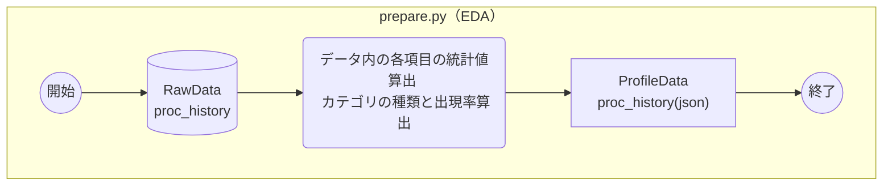
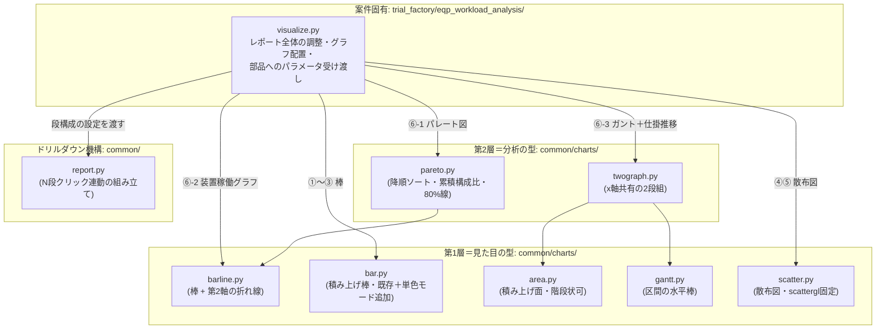

# design.md — <開発タイトル>の設計

## 対象

### 構成物一覧

今回の作業で新規作成・変更する構成物を一覧にする。次のルールを守る。

- **1オブジェクト1行**で書く。`{a,b,c}.py`のようなまとめ書きはしない
  （ファイルごとに行を分ける）
- **グラフは対象外**にする。グラフの種類・見せ方は要求仕様
  （`requirements.md`・本ファイルの「画面レイアウト」）側の対象であり、
  ここに書くとコードの行と重複する
- **種別は英語3文字**で統一する（例: `SCR`=画面、`SRC`=コード、
  `DAT`=データ、`DOC`=ドキュメント）。ドキュメントが縦長になりすぎるのを
  防ぐため

| 種別 | 名称 | 対応種別 | 内容 |
| --- | --- | --- | --- |
| SCR | AAA | 新 | 〇〇の結合する |
| SRC | BBB.py | 変 | 2段だったのを3段に変更 |
| DAT | CCC | 変 | 2段だったのを3段に変更 |
| DOC | docs/xxx.md | 変 | 〇〇の記載を追加 |

## 画面レイアウト

可視化を含む場合、確定版の画面配置（モックのスクリーンショット・
Artifactへのリンク・ワイヤーフレーム等）をここに置く。

## 画面遷移図

クリック等の操作でどの画面・グラフに遷移するか（ドリルダウンの段数、
何をクリックすると何が起きるか）を図で示す。

## 機能別処理フロー

モジュール（`prepare.py`/`process.py`/`analyze.py`/`visualize.py`等）
ごとに、処理順序を表すアクティビティ図をMermaidで書く。1モジュール
1図を基本とし、大きくなる場合のみ分割する。呼び出し関係（import の
方向）は表さない（それは「コンポーネント構成図」の役割）。表記方法は
`docs/diagram-guidelines.md`の「アクティビティ図（処理順序図）の
描き方」に従う。

## コンポーネント構成図

モジュール間の依存関係（import する方向）をMermaidで書く。共通処理
（`common/`）とツール固有コードの境界、層構造を採る場合はその層の
上下関係が分かるようにする。

## 課題対応

設計中に判明した課題・懸念点と、それぞれへの対応（結論）を書く。
経緯（誰が指摘したか等）ではなく、結論と根拠だけを残す。

## 残課題

`tasklist.md`着手前に確認・決定しておきたい未確定事項を列挙する。
